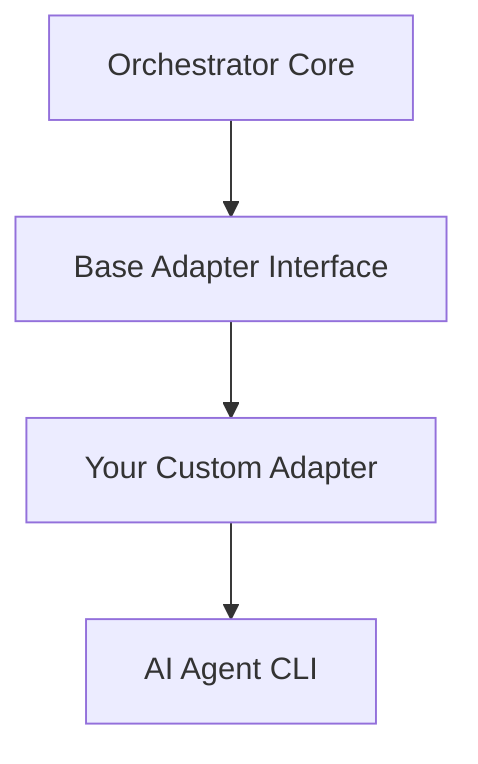
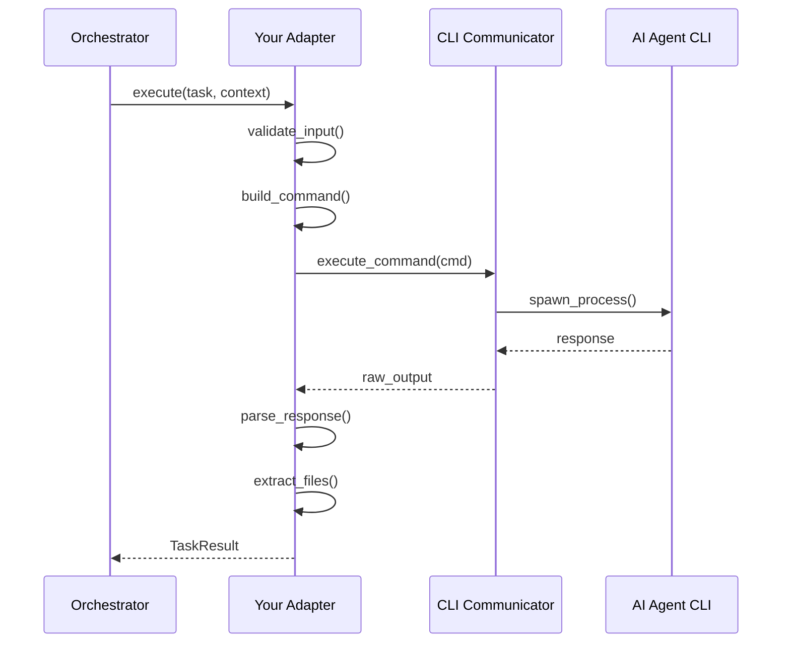

# Adding New AI Agents

## Table of Contents

- [Overview](#overview)
- [Architecture Overview](#architecture-overview)
- [Step-by-Step Guide](#step-by-step-guide)
- [Configuration](#configuration)
- [Testing](#testing)
- [Advanced Topics](#advanced-topics)
- [Best Practices](#best-practices)
- [Examples](#examples)
- [Troubleshooting](#troubleshooting)

## Overview

The AI Orchestrator is designed to be easily extensible. You can add support for new AI coding assistants by creating a new adapter that implements the standard interface.

### What You Need

- Python knowledge
- The AI agent's CLI tool installed
- Understanding of the agent's command structure
- Basic knowledge of the adapter pattern

### Time Required

- Simple adapter: 30-60 minutes
- Complex adapter with special features: 2-4 hours
- Testing and documentation: 1-2 hours

## Architecture Overview

### Adapter Pattern



### Component Interaction



## Step-by-Step Guide

### Step 1: Create Adapter File

Create a new file in the `adapters/` directory:

```bash
touch adapters/your_agent_adapter.py
```

### Step 2: Import Required Modules

```python
from typing import Dict, Any, List, Optional
from adapters.base import BaseAdapter, TaskResult
from adapters.cli_communicator import CLICommunicator
from orchestrator.exceptions import AdapterError, ValidationError
import logging
import re
import json

logger = logging.getLogger(__name__)
```

### Step 3: Define Adapter Class

```python
class YourAgentAdapter(BaseAdapter):
    """
    Adapter for Your AI Agent CLI.

    This adapter integrates Your AI Agent with the orchestrator,
    enabling it to participate in collaborative workflows.
    """

    def __init__(self, config: Dict[str, Any]):
        """
        Initialize the adapter with configuration.

        Args:
            config: Agent configuration dictionary
        """
        super().__init__(config)
        self.name = "your_agent"
        self.command = config.get("command", "your-agent-cli")
        self.timeout = config.get("timeout", 300)
        self.communicator = CLICommunicator()

        logger.info(f"Initialized {self.name} adapter")
```

### Step 4: Implement Required Methods

#### execute() Method

```python
def execute(self, task: str, context: Optional[Dict[str, Any]] = None) -> TaskResult:
    """
    Execute a task using Your AI Agent.

    Args:
        task: The task description
        context: Optional context from previous tasks

    Returns:
        TaskResult containing output and generated files

    Raises:
        AdapterError: If execution fails
    """
    try:
        # Validate input
        if not self.validate_input(task):
            raise ValidationError(f"Invalid task: {task}")

        # Build command
        cmd = self._build_command(task, context)

        # Execute with CLI communicator
        logger.info(f"Executing task with {self.name}")
        response = self.communicator.execute(
            cmd,
            timeout=self.timeout,
            capture_output=True
        )

        # Parse response
        parsed_output = self._parse_response(response.stdout)

        # Extract generated files
        files = self._extract_files(parsed_output)

        # Validate response
        if not self.validate_response(parsed_output):
            raise AdapterError("Invalid response from agent")

        return TaskResult(
            agent=self.name,
            output=parsed_output,
            files=files,
            success=True,
            metadata={
                "duration": response.duration,
                "exit_code": response.returncode
            }
        )

    except Exception as e:
        logger.error(f"Error executing task with {self.name}: {e}")
        return TaskResult(
            agent=self.name,
            output="",
            files=[],
            success=False,
            error=str(e)
        )
```

#### validate_input() Method

```python
def validate_input(self, task: str) -> bool:
    """
    Validate task input before execution.

    Args:
        task: Task description to validate

    Returns:
        True if valid, False otherwise
    """
    if not task or not task.strip():
        logger.error("Empty task provided")
        return False

    if len(task) > 10000:  # Max task length
        logger.error("Task too long")
        return False

    # Add agent-specific validation
    # e.g., check for required keywords, format, etc.

    return True
```

#### validate_response() Method

```python
def validate_response(self, response: str) -> bool:
    """
    Validate agent response.

    Args:
        response: Agent response to validate

    Returns:
        True if valid, False otherwise
    """
    if not response:
        return False

    # Add agent-specific validation
    # e.g., check for expected format, required fields, etc.

    return True
```

### Step 5: Implement Helper Methods

#### _build_command()

```python
def _build_command(self, task: str, context: Optional[Dict[str, Any]] = None) -> List[str]:
    """
    Build CLI command for the agent.

    Args:
        task: Task description
        context: Optional context from previous tasks

    Returns:
        Command as list of strings
    """
    cmd = [self.command]

    # Add agent-specific flags
    cmd.extend(["--task", task])

    # Add context if available
    if context:
        if "previous_output" in context:
            cmd.extend(["--context", context["previous_output"]])

        if "files" in context:
            cmd.extend(["--files", ",".join(context["files"])])

    # Add any additional flags
    cmd.extend([
        "--format", "json",  # Request structured output
        "--verbose"
    ])

    return cmd
```

#### _parse_response()

```python
def _parse_response(self, raw_output: str) -> str:
    """
    Parse agent's raw output into structured format.

    Args:
        raw_output: Raw output from agent CLI

    Returns:
        Parsed and formatted output
    """
    try:
        # If agent returns JSON
        data = json.loads(raw_output)
        return data.get("output", raw_output)
    except json.JSONDecodeError:
        # Fallback to raw output
        return raw_output.strip()
```

#### _extract_files()

```python
def _extract_files(self, output: str) -> List[str]:
    """
    Extract file paths from agent output.

    Args:
        output: Agent output to parse

    Returns:
        List of file paths mentioned in output
    """
    files = []

    # Look for common file path patterns
    # Adjust regex based on your agent's output format
    patterns = [
        r'(?:Created|Generated|Wrote)\s+(?:file\s+)?["\']?([^\s"\']+\.\w+)["\']?',
        r'```[\w]*\s*#\s*([^\n]+\.\w+)',
        r'File:\s*([^\s]+\.\w+)'
    ]

    for pattern in patterns:
        matches = re.findall(pattern, output, re.MULTILINE)
        files.extend(matches)

    # Remove duplicates and validate
    files = list(set(files))
    files = [f for f in files if self._is_valid_filepath(f)]

    return files

def _is_valid_filepath(self, filepath: str) -> bool:
    """Validate that a string looks like a valid file path."""
    import os
    # Check it's not too long, doesn't have dangerous characters, etc.
    if len(filepath) > 255:
        return False
    if any(c in filepath for c in ['<', '>', '|', '\0']):
        return False
    return True
```

### Step 6: Add to Base Adapter Registry

Edit `adapters/__init__.py`:

```python
from adapters.your_agent_adapter import YourAgentAdapter

ADAPTER_REGISTRY = {
    "claude": ClaudeAdapter,
    "codex": CodexAdapter,
    "gemini": GeminiAdapter,
    "copilot": CopilotAdapter,
    "your_agent": YourAgentAdapter,  # Add your adapter
}

def get_adapter(agent_name: str, config: Dict[str, Any]) -> BaseAdapter:
    """Get adapter instance by name."""
    adapter_class = ADAPTER_REGISTRY.get(agent_name)
    if not adapter_class:
        raise ValueError(f"Unknown agent: {agent_name}")
    return adapter_class(config)
```

## Configuration

### Add to agents.yaml

```yaml
agents:
  your_agent:
    enabled: true
    command: "your-agent-cli"
    role: "implementation"  # or "review", "refinement", etc.
    timeout: 300
    description: "Your AI Agent description"

    # Agent-specific configuration
    options:
      model: "your-model-name"
      temperature: 0.7
      max_tokens: 2000
```

### Add to Workflows

```yaml
workflows:
  with_your_agent:
    - agent: "codex"
      task: "implement"
    - agent: "your_agent"
      task: "enhance"
    - agent: "gemini"
      task: "review"
```

## Testing

### Create Test File

Create `tests/test_your_agent_adapter.py`:

```python
import pytest
from unittest.mock import Mock, patch
from adapters.your_agent_adapter import YourAgentAdapter

class TestYourAgentAdapter:
    """Test suite for Your Agent Adapter."""

    @pytest.fixture
    def adapter(self):
        """Create adapter instance for testing."""
        config = {
            "command": "your-agent-cli",
            "timeout": 300,
            "role": "implementation"
        }
        return YourAgentAdapter(config)

    def test_initialization(self, adapter):
        """Test adapter initializes correctly."""
        assert adapter.name == "your_agent"
        assert adapter.command == "your-agent-cli"
        assert adapter.timeout == 300

    def test_validate_input_valid(self, adapter):
        """Test input validation with valid input."""
        assert adapter.validate_input("Create a function")

    def test_validate_input_empty(self, adapter):
        """Test input validation rejects empty input."""
        assert not adapter.validate_input("")
        assert not adapter.validate_input("   ")

    def test_build_command(self, adapter):
        """Test command building."""
        task = "Create a function"
        cmd = adapter._build_command(task)

        assert "your-agent-cli" in cmd
        assert "--task" in cmd
        assert "Create a function" in cmd

    @patch('adapters.your_agent_adapter.CLICommunicator')
    def test_execute_success(self, mock_communicator, adapter):
        """Test successful task execution."""
        # Mock CLI response
        mock_response = Mock()
        mock_response.stdout = '{"output": "Function created"}'
        mock_response.returncode = 0
        mock_response.duration = 1.5

        mock_communicator.return_value.execute.return_value = mock_response
        adapter.communicator = mock_communicator.return_value

        # Execute task
        result = adapter.execute("Create a function")

        assert result.success
        assert result.agent == "your_agent"
        assert "Function created" in result.output

    def test_parse_response_json(self, adapter):
        """Test parsing JSON response."""
        json_output = '{"output": "Test output"}'
        parsed = adapter._parse_response(json_output)
        assert parsed == "Test output"

    def test_parse_response_plain_text(self, adapter):
        """Test parsing plain text response."""
        text_output = "Plain text output"
        parsed = adapter._parse_response(text_output)
        assert parsed == "Plain text output"

    def test_extract_files(self, adapter):
        """Test file extraction from output."""
        output = """
        Created file main.py
        Generated test.py
        Wrote docs.md
        """
        files = adapter._extract_files(output)

        assert "main.py" in files
        assert "test.py" in files
        assert "docs.md" in files
```

### Run Tests

```bash
# Run your adapter tests
pytest tests/test_your_agent_adapter.py -v

# Run with coverage
pytest tests/test_your_agent_adapter.py --cov=adapters.your_agent_adapter

# Run all adapter tests
pytest tests/test_adapters.py -v
```

### Integration Testing

Create `tests/test_integration_your_agent.py`:

```python
import pytest
from orchestrator.core import Orchestrator

@pytest.mark.integration
class TestYourAgentIntegration:
    """Integration tests for Your Agent."""

    def test_full_workflow_with_your_agent(self):
        """Test complete workflow including your agent."""
        orchestrator = Orchestrator(config_path="config/agents.yaml")

        result = orchestrator.execute_task(
            task="Create a simple function",
            workflow="with_your_agent"
        )

        assert result.success
        assert len(result.files) > 0
```

## Advanced Topics

### Handling Streaming Output

If your agent supports streaming:

```python
def execute_streaming(self, task: str, callback=None):
    """Execute task with streaming output."""
    cmd = self._build_command(task)

    process = subprocess.Popen(
        cmd,
        stdout=subprocess.PIPE,
        stderr=subprocess.PIPE,
        text=True,
        bufsize=1
    )

    output = []
    for line in process.stdout:
        output.append(line)
        if callback:
            callback(line)  # Real-time callback

    process.wait()
    return "".join(output)
```

### Supporting Different Output Formats

```python
def _parse_response(self, raw_output: str, format_type: str = "auto") -> str:
    """Parse response supporting multiple formats."""
    if format_type == "json" or (format_type == "auto" and raw_output.strip().startswith("{")):
        return self._parse_json(raw_output)
    elif format_type == "xml":
        return self._parse_xml(raw_output)
    elif format_type == "markdown":
        return self._parse_markdown(raw_output)
    else:
        return raw_output.strip()
```

### Custom Error Handling

```python
class YourAgentError(AdapterError):
    """Custom exception for Your Agent specific errors."""
    pass

def execute(self, task: str, context: Optional[Dict[str, Any]] = None) -> TaskResult:
    try:
        # ... execution code ...
    except YourAgentSpecificException as e:
        raise YourAgentError(f"Agent-specific error: {e}")
    except Exception as e:
        logger.error(f"Unexpected error: {e}")
        raise AdapterError(f"Failed to execute: {e}")
```

### Caching Support

```python
from functools import lru_cache
import hashlib

def execute(self, task: str, context: Optional[Dict[str, Any]] = None) -> TaskResult:
    # Generate cache key
    cache_key = self._generate_cache_key(task, context)

    # Check cache
    if cached_result := self._get_from_cache(cache_key):
        logger.info(f"Cache hit for task: {task[:50]}...")
        return cached_result

    # Execute and cache
    result = self._execute_task(task, context)
    self._save_to_cache(cache_key, result)

    return result

def _generate_cache_key(self, task: str, context: Optional[Dict[str, Any]]) -> str:
    """Generate cache key from task and context."""
    data = f"{task}:{json.dumps(context, sort_keys=True) if context else ''}"
    return hashlib.sha256(data.encode()).hexdigest()
```

## Best Practices

### 1. Error Handling

```python
def execute(self, task: str, context: Optional[Dict[str, Any]] = None) -> TaskResult:
    try:
        # Execution code
        pass
    except ValidationError as e:
        logger.error(f"Validation failed: {e}")
        return TaskResult(success=False, error=str(e))
    except TimeoutError as e:
        logger.error(f"Timeout: {e}")
        return TaskResult(success=False, error="Agent timed out")
    except Exception as e:
        logger.exception(f"Unexpected error: {e}")
        return TaskResult(success=False, error=f"Unexpected error: {e}")
```

### 2. Logging

```python
import logging

logger = logging.getLogger(__name__)

def execute(self, task: str, context: Optional[Dict[str, Any]] = None) -> TaskResult:
    logger.info(f"Executing task with {self.name}", extra={
        "task_length": len(task),
        "has_context": context is not None
    })

    # ... execution ...

    logger.info(f"Task completed successfully", extra={
        "duration": duration,
        "files_generated": len(files)
    })
```

### 3. Input Sanitization

```python
def _sanitize_task(self, task: str) -> str:
    """Sanitize task input."""
    # Remove control characters
    task = re.sub(r'[\x00-\x1f\x7f-\x9f]', '', task)

    # Limit length
    if len(task) > MAX_TASK_LENGTH:
        task = task[:MAX_TASK_LENGTH]

    # Escape special characters for shell
    task = shlex.quote(task)

    return task
```

### 4. Configuration Validation

```python
from pydantic import BaseModel, validator

class YourAgentConfig(BaseModel):
    """Configuration schema for Your Agent."""

    command: str
    timeout: int = 300
    role: str
    model: Optional[str] = None

    @validator('timeout')
    def validate_timeout(cls, v):
        if v < 1 or v > 3600:
            raise ValueError('Timeout must be between 1 and 3600 seconds')
        return v

    @validator('role')
    def validate_role(cls, v):
        allowed_roles = ['implementation', 'review', 'refinement', 'suggestions']
        if v not in allowed_roles:
            raise ValueError(f'Role must be one of {allowed_roles}')
        return v
```

### 5. Resource Cleanup

```python
def execute(self, task: str, context: Optional[Dict[str, Any]] = None) -> TaskResult:
    temp_files = []
    try:
        # Create temp files if needed
        temp_file = self._create_temp_input(task)
        temp_files.append(temp_file)

        # Execute
        result = self._execute_task(temp_file)
        return result

    finally:
        # Always cleanup
        for temp_file in temp_files:
            if os.path.exists(temp_file):
                os.remove(temp_file)
```

## Examples

### Example 1: Simple Text-Based Agent

```python
class SimpleTextAdapter(BaseAdapter):
    """Adapter for a simple text-based AI agent."""

    def __init__(self, config: Dict[str, Any]):
        super().__init__(config)
        self.name = "simple_text"
        self.command = config.get("command", "simple-ai")

    def execute(self, task: str, context: Optional[Dict[str, Any]] = None) -> TaskResult:
        # Build simple command
        cmd = [self.command, task]

        # Execute
        result = subprocess.run(
            cmd,
            capture_output=True,
            text=True,
            timeout=self.timeout
        )

        return TaskResult(
            agent=self.name,
            output=result.stdout.strip(),
            files=[],
            success=result.returncode == 0
        )

    def validate_input(self, task: str) -> bool:
        return bool(task and task.strip())

    def validate_response(self, response: str) -> bool:
        return bool(response)
```

### Example 2: REST API-Based Agent

```python
import requests

class APIBasedAdapter(BaseAdapter):
    """Adapter for an AI agent with REST API."""

    def __init__(self, config: Dict[str, Any]):
        super().__init__(config)
        self.api_url = config.get("api_url")
        self.api_key = config.get("api_key")

    def execute(self, task: str, context: Optional[Dict[str, Any]] = None) -> TaskResult:
        payload = {
            "task": task,
            "context": context
        }

        headers = {
            "Authorization": f"Bearer {self.api_key}",
            "Content-Type": "application/json"
        }

        response = requests.post(
            f"{self.api_url}/execute",
            json=payload,
            headers=headers,
            timeout=self.timeout
        )

        response.raise_for_status()
        data = response.json()

        return TaskResult(
            agent=self.name,
            output=data.get("output", ""),
            files=data.get("files", []),
            success=True
        )
```

## Troubleshooting

### Common Issues

#### Agent Not Found

**Problem**: `Agent 'your_agent' not found in registry`

**Solution**:
```python
# Check adapters/__init__.py
from adapters.your_agent_adapter import YourAgentAdapter

ADAPTER_REGISTRY = {
    # ...
    "your_agent": YourAgentAdapter,  # Add this line
}
```

#### CLI Communication Fails

**Problem**: Agent CLI doesn't respond or times out

**Solution**:
```python
# Add debug logging
logger.debug(f"Executing command: {cmd}")
logger.debug(f"Timeout: {self.timeout}")

# Increase timeout
timeout: 600  # in config
```

#### Parse Errors

**Problem**: Can't parse agent output

**Solution**:
```python
def _parse_response(self, raw_output: str) -> str:
    logger.debug(f"Raw output: {raw_output}")

    try:
        # Try JSON first
        return json.loads(raw_output)
    except:
        # Fallback to text
        logger.warning("Failed to parse JSON, using raw text")
        return raw_output
```

### Debug Mode

Enable detailed logging:

```python
import logging

# In your adapter
logger = logging.getLogger(__name__)
logger.setLevel(logging.DEBUG)

# Add detailed logs
logger.debug(f"Built command: {cmd}")
logger.debug(f"Context provided: {context}")
logger.debug(f"Raw response: {response.stdout}")
```

### Testing Tips

1. **Test CLI Manually First**
   ```bash
   your-agent-cli --task "test task"
   ```

2. **Use Mock Objects**
   ```python
   from unittest.mock import Mock, patch

   @patch('subprocess.run')
   def test_execute(self, mock_run):
       mock_run.return_value = Mock(stdout="output", returncode=0)
       # Test your adapter
   ```

3. **Test with Real Agent**
   ```python
   @pytest.mark.integration
   @pytest.mark.skipif(not has_agent(), reason="Agent not installed")
   def test_real_execution(self):
       # Test with actual agent
   ```

---

## Next Steps

After creating your adapter:

1. ✅ Test thoroughly
2. ✅ Add to documentation
3. ✅ Create example workflows
4. ✅ Submit PR (if contributing)
5. ✅ Share with community

## Additional Resources

- [Base Adapter Code](adapters/base.py)
- [Existing Adapters](adapters/)
- [Test Examples](tests/test_adapters.py)
- [Architecture Documentation](ARCHITECTURE.md)

---

**Need help?** Open an issue or discussion on GitHub!
