# Architecture Documentation

## Table of Contents

- [Overview](#overview)
- [System Architecture](#system-architecture)
- [Component Design](#component-design)
- [Data Flow](#data-flow)
- [Adapter Pattern](#adapter-pattern)
- [Workflow Engine](#workflow-engine)
- [Security Architecture](#security-architecture)
- [Monitoring & Observability](#monitoring--observability)
- [Deployment Architecture](#deployment-architecture)
- [Design Patterns](#design-patterns)

## Overview

The AI Coding Tools Orchestrator is built on a modular, extensible architecture that enables multiple AI agents to collaborate effectively. The system follows enterprise design patterns and best practices for scalability, reliability, and maintainability.

### Core Principles

- **Modularity**: Clear separation of concerns between components
- **Extensibility**: Easy to add new agents and workflows
- **Reliability**: Robust error handling and retry logic
- **Performance**: Async execution and intelligent caching
- **Security**: Input validation, rate limiting, and audit logging
- **Observability**: Comprehensive metrics and structured logging

## System Architecture

### High-Level Architecture

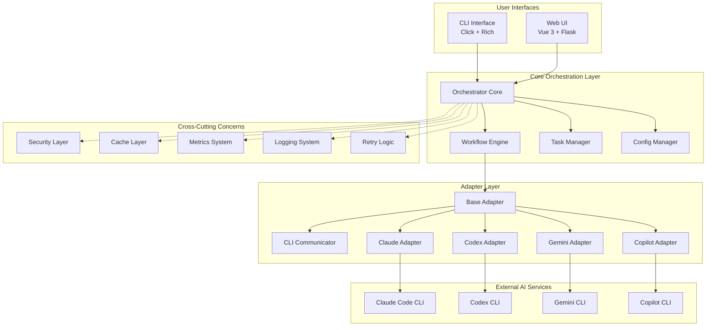

### Component Layers

1. **Interface Layer** - User-facing interfaces (CLI and Web UI)
2. **Orchestration Layer** - Core business logic and workflow management
3. **Cross-Cutting Layer** - Security, caching, metrics, logging
4. **Adapter Layer** - AI agent integrations
5. **External Services** - Third-party AI CLIs

## Component Design

### Orchestrator Core

The central component that coordinates all operations.

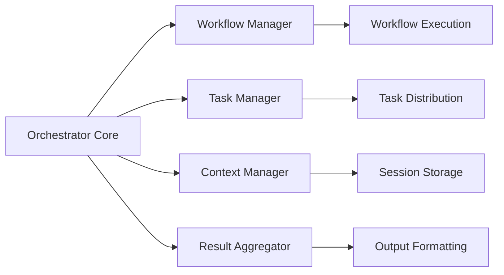

**Responsibilities:**
- Task reception and parsing
- Workflow selection and execution
- Agent coordination
- Result aggregation
- Session management

**Key Files:**
- `orchestrator/core.py` - Main orchestrator logic
- `orchestrator/workflow.py` - Workflow management
- `orchestrator/task_manager.py` - Task distribution

### Workflow Engine

Manages workflow definitions and execution.

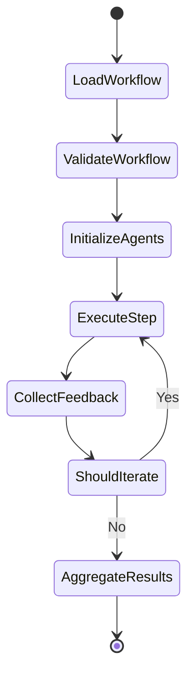

**Workflow Types:**

1. **Sequential** - Agents execute one after another
2. **Parallel** - Multiple agents execute simultaneously
3. **Iterative** - Repeated cycles with feedback
4. **Conditional** - Branch based on results

**Configuration:**
```yaml
workflows:
  default:
    - agent: "codex"
      task: "implement"
    - agent: "gemini"
      task: "review"
    - agent: "claude"
      task: "refine"
```

### Adapter Layer

Abstracts AI agent interactions through a common interface.

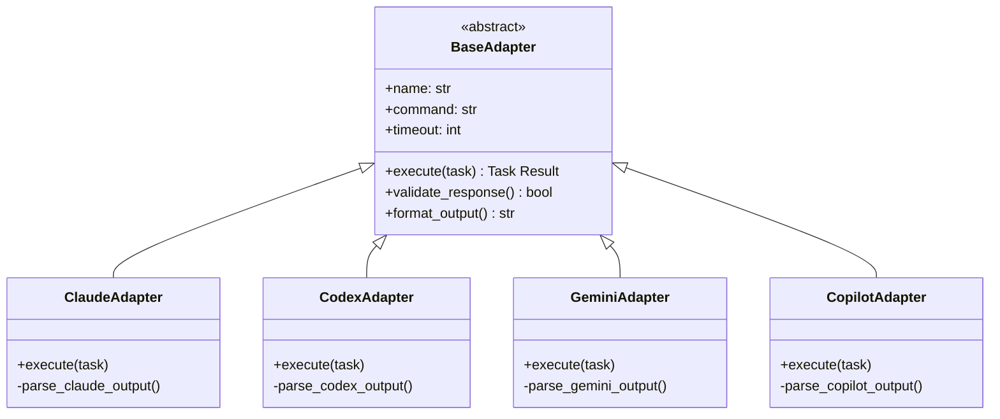

**Base Adapter Interface:**
```python
class BaseAdapter(ABC):
    @abstractmethod
    def execute(self, task: str, context: Dict[str, Any]) -> TaskResult:
        """Execute task with the AI agent"""
        pass

    @abstractmethod
    def validate_response(self, response: str) -> bool:
        """Validate agent response"""
        pass

    @abstractmethod
    def format_output(self, response: str) -> str:
        """Format output for consumption"""
        pass
```

### CLI Communicator

Handles robust communication with external CLI tools.

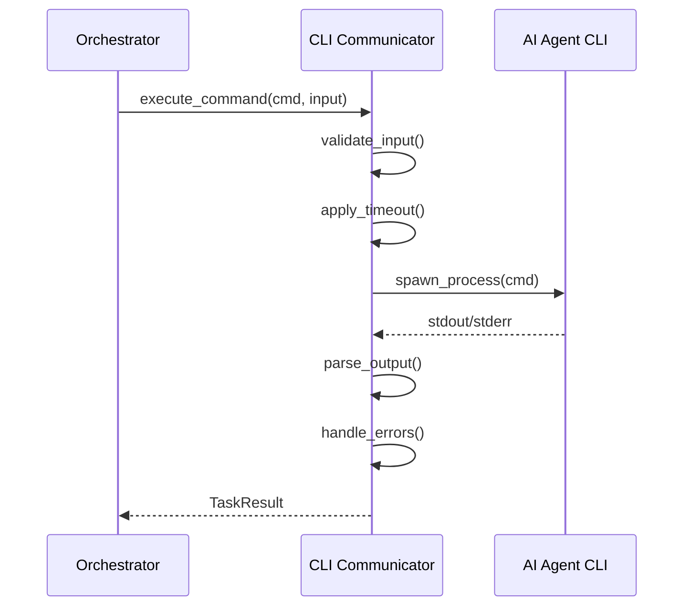

**Features:**
- Process management
- Timeout handling
- Error recovery
- Output parsing
- Retry logic

## Data Flow

### Task Execution Flow

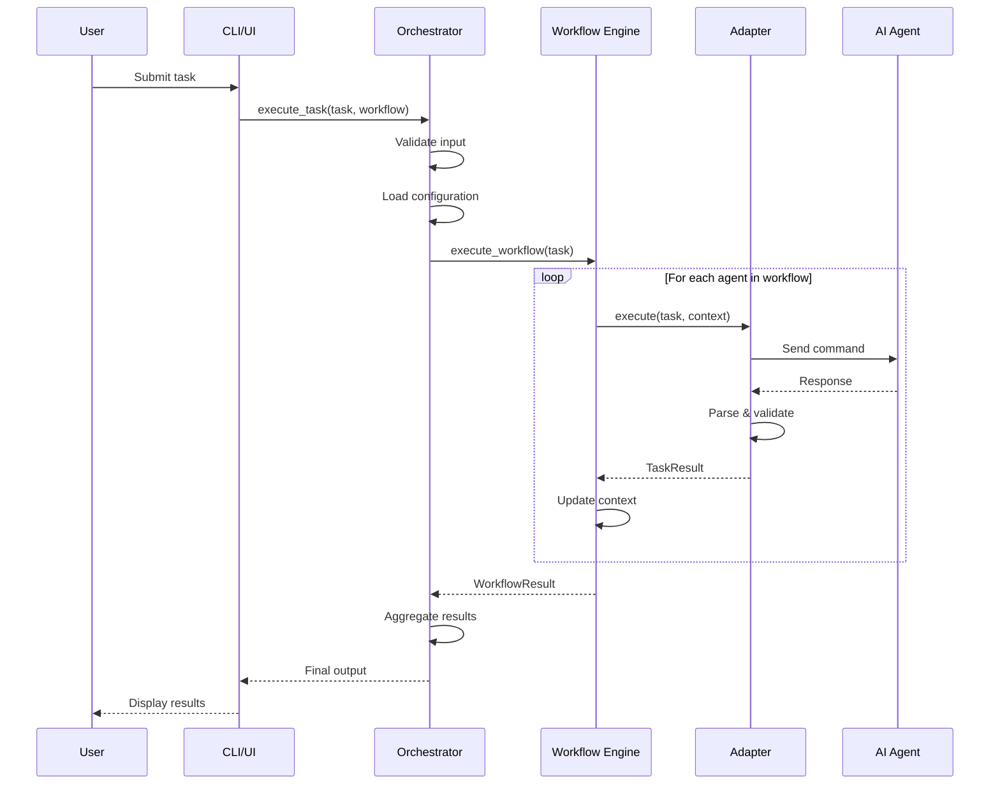

### Conversation Mode Flow

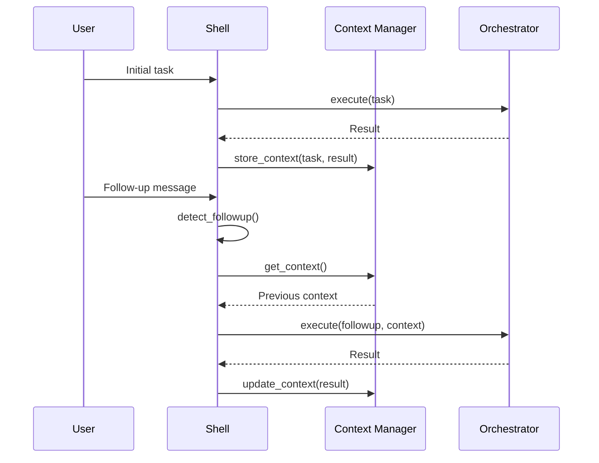

### File Generation Flow

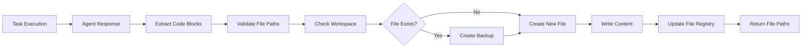

## Adapter Pattern

### Why Adapters?

Adapters provide a consistent interface to heterogeneous AI agent CLIs:

- **Abstraction**: Hide CLI-specific details
- **Consistency**: Uniform interface for all agents
- **Flexibility**: Easy to swap or add agents
- **Testability**: Mock adapters for testing
- **Resilience**: Isolated error handling

### Adapter Implementation

```python
class ClaudeAdapter(BaseAdapter):
    def __init__(self, config: Dict[str, Any]):
        super().__init__(config)
        self.command = config.get("command", "claude")
        self.timeout = config.get("timeout", 300)

    def execute(self, task: str, context: Dict[str, Any]) -> TaskResult:
        # Build command
        cmd = self._build_command(task, context)

        # Execute with retry logic
        response = self.communicator.execute(
            cmd,
            timeout=self.timeout,
            retries=3
        )

        # Parse and validate
        parsed = self._parse_response(response)
        if not self.validate_response(parsed):
            raise AdapterError("Invalid response")

        return TaskResult(
            agent=self.name,
            output=parsed,
            files=self._extract_files(parsed),
            success=True
        )
```

## Workflow Engine

### Workflow Execution

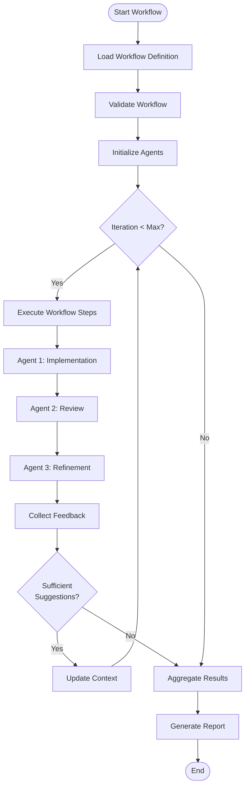

### Workflow Configuration

Workflows are defined in YAML:

```yaml
workflows:
  thorough:
    max_iterations: 5
    min_suggestions_threshold: 3
    steps:
      - agent: "codex"
        task: "implement"
        description: "Create initial implementation"

      - agent: "copilot"
        task: "suggestions"
        description: "Get alternative approaches"
        optional: true

      - agent: "gemini"
        task: "review"
        description: "Comprehensive code review"

      - agent: "claude"
        task: "refine"
        description: "Implement feedback"

      - agent: "gemini"
        task: "review"
        description: "Verify improvements"
```

## Security Architecture

### Security Layers

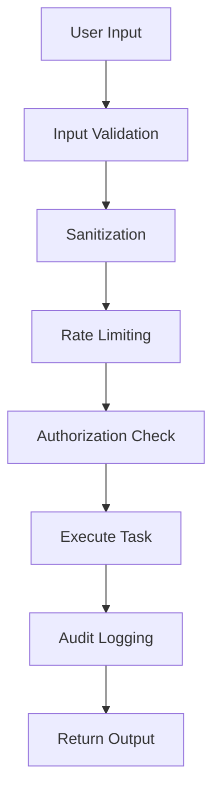

### Security Components

1. **Input Validation**
   - Command injection prevention
   - Path traversal protection
   - Malicious payload detection

2. **Rate Limiting**
   - Token bucket algorithm
   - Per-user limits
   - Global rate limits

3. **Secret Management**
   - Environment variables
   - Secure key storage
   - No hardcoded credentials

4. **Audit Logging**
   - All security events logged
   - Tamper-proof logs
   - Retention policies

**Implementation:**
```python
class SecurityManager:
    def validate_input(self, user_input: str) -> bool:
        # Check for command injection
        if self._contains_shell_metacharacters(user_input):
            raise SecurityError("Potential command injection")

        # Check for path traversal
        if self._contains_path_traversal(user_input):
            raise SecurityError("Path traversal detected")

        return True

    def rate_limit_check(self, user_id: str) -> bool:
        if not self.rate_limiter.allow_request(user_id):
            raise RateLimitError("Rate limit exceeded")
        return True
```

## Monitoring & Observability

### Metrics Architecture

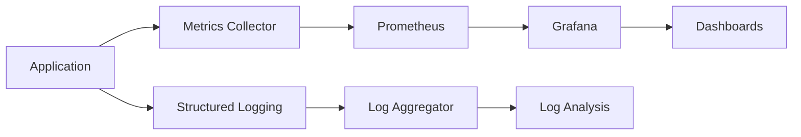

### Key Metrics

**Task Metrics:**
- `orchestrator_tasks_total` - Counter
- `orchestrator_task_duration_seconds` - Histogram
- `orchestrator_task_failures_total` - Counter

**Agent Metrics:**
- `orchestrator_agent_calls_total` - Counter
- `orchestrator_agent_errors_total` - Counter
- `orchestrator_agent_response_time_seconds` - Histogram

**System Metrics:**
- `orchestrator_cache_hits_total` - Counter
- `orchestrator_cache_misses_total` - Counter
- `orchestrator_active_sessions` - Gauge

### Structured Logging

```python
import structlog

logger = structlog.get_logger()

logger.info(
    "task_executed",
    task_id="task-123",
    workflow="default",
    duration_ms=1234.56,
    agent="codex",
    success=True
)
```

## Deployment Architecture

### Container Architecture

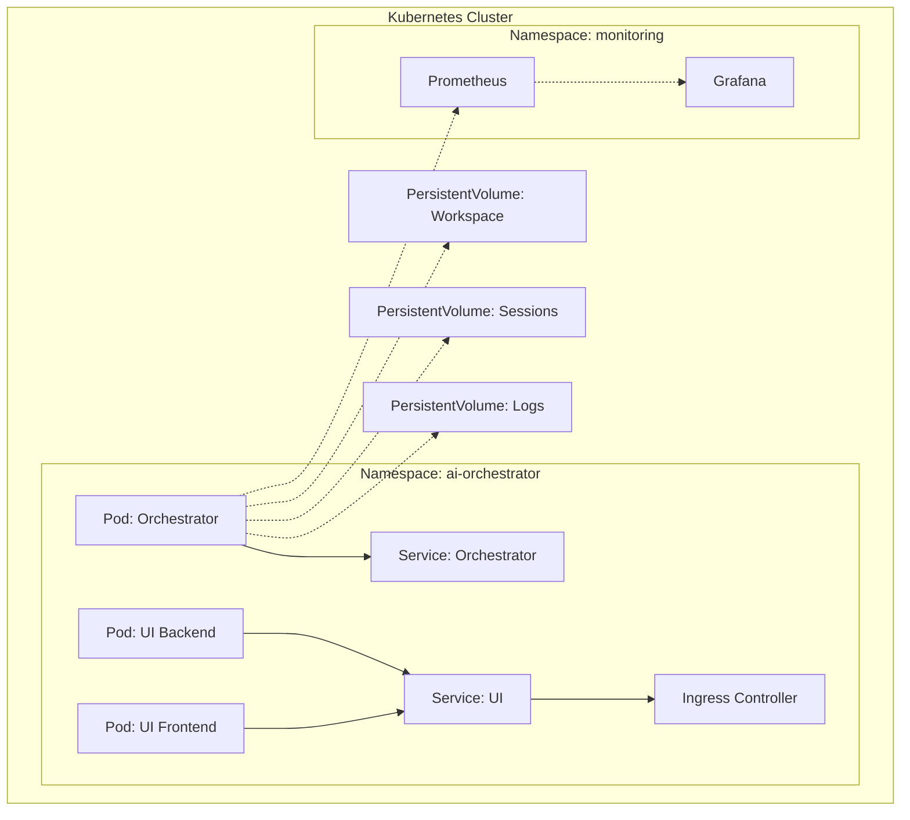

### Docker Compose Setup

```yaml
version: '3.8'

services:
  orchestrator:
    build: .
    volumes:
      - ./workspace:/app/workspace
      - ./sessions:/app/sessions
    ports:
      - "9090:9090"  # Metrics
    environment:
      - LOG_LEVEL=INFO
      - ENABLE_METRICS=true

  prometheus:
    image: prom/prometheus
    volumes:
      - ./monitoring/prometheus.yml:/etc/prometheus/prometheus.yml
    ports:
      - "9091:9090"

  grafana:
    image: grafana/grafana
    ports:
      - "3000:3000"
    environment:
      - GF_SECURITY_ADMIN_PASSWORD=admin
```

## Design Patterns

### Patterns Used

#### 1. Adapter Pattern
Provides a uniform interface to different AI agent CLIs.

#### 2. Strategy Pattern
Workflows implement different strategies for task execution.

#### 3. Chain of Responsibility
Request processing through validation, execution, and post-processing.

#### 4. Observer Pattern
Real-time updates in Web UI via Socket.IO.

#### 5. Factory Pattern
Agent and workflow creation.

#### 6. Singleton Pattern
Configuration manager, metrics collector.

#### 7. Decorator Pattern
Retry logic, caching, logging decorators.

### Example: Retry Decorator

```python
from functools import wraps
from tenacity import retry, stop_after_attempt, wait_exponential

def with_retry(max_attempts=3):
    def decorator(func):
        @wraps(func)
        @retry(
            stop=stop_after_attempt(max_attempts),
            wait=wait_exponential(multiplier=1, min=2, max=10)
        )
        def wrapper(*args, **kwargs):
            return func(*args, **kwargs)
        return wrapper
    return decorator

@with_retry(max_attempts=3)
def execute_agent_task(agent, task):
    return agent.execute(task)
```

## Performance Considerations

### Caching Strategy

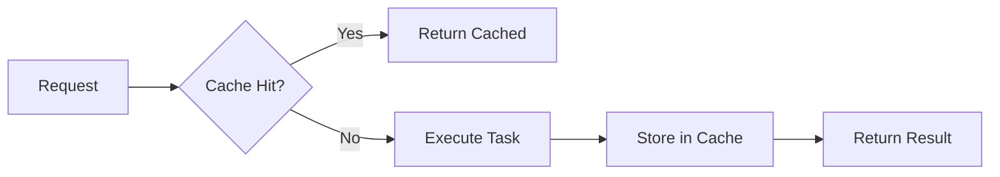

**Cache Types:**
- **In-memory**: Fast, volatile (TTL: 5 minutes)
- **File-based**: Persistent, slower (TTL: 24 hours)
- **Distributed**: Redis/Memcached (optional)

### Async Execution

```python
import asyncio

async def execute_workflow_async(tasks: List[Task]):
    # Parallel agent execution where possible
    results = await asyncio.gather(
        *[agent.execute_async(task) for task in tasks],
        return_exceptions=True
    )
    return results
```

## Scalability

### Horizontal Scaling

- **Stateless Design**: Sessions stored externally
- **Load Balancing**: Multiple orchestrator instances
- **Database**: Shared configuration and state
- **Message Queue**: Task distribution (future enhancement)

### Vertical Scaling

- **Connection Pooling**: Reuse connections to AI services
- **Worker Threads**: Parallel task processing
- **Memory Management**: Efficient caching strategies
- **Resource Limits**: CPU and memory constraints

## Future Architecture Enhancements

1. **Message Queue Integration** - RabbitMQ/Kafka for task distribution
2. **Distributed Caching** - Redis cluster for shared cache
3. **Service Mesh** - Istio for advanced traffic management
4. **Event Sourcing** - Complete audit trail of all operations
5. **GraphQL API** - Flexible query interface
6. **WebSocket Streaming** - Real-time task progress
7. **Multi-tenancy** - Isolated environments for multiple users
8. **Plugin System** - Dynamic agent loading

---

For more information:
- [Features Documentation](FEATURES.md)
- [Setup Guide](SETUP.md)
- [Adding Agents Guide](ADD_AGENTS.md)
