# 🎉 AI Orchestrator - Complete User Guide

## Table of Contents
1. [Quick Start](#quick-start)
2. [CLI Usage](#cli-usage)
3. [Web UI Usage](#web-ui-usage)
4. [Conversation Mode](#conversation-mode)
5. [Features](#features)
6. [Troubleshooting](#troubleshooting)

---

## Quick Start

### Option 1: CLI
```bash
./ai-orchestrator interactive
```

### Option 2: Web UI
```bash
./start-ui.sh
# Open http://localhost:3000
```

---

## CLI Usage

### Starting the Shell

```bash
./ai-orchestrator interactive
# or
./ai-orchestrator shell
```

### Natural Conversation Flow

```bash
orchestrator (default): create a Python calculator
✓ Task completed!

# Just type naturally - it auto-detects follow-ups!
orchestrator (default): add error handling
💡 Detected as follow-up to previous task
✓ Error handling added!

orchestrator (default): also add unit tests
💡 Detected as follow-up to previous task
✓ Tests added!
```

### Auto-Detection Features

**Automatically continues when you use keywords:**
- add, also, now, then, next
- improve, fix, change, update
- make it, can you, please

**Example:**
```bash
> create API
> add authentication       # Auto follow-up ✓
> also add rate limiting  # Auto follow-up ✓
> now add logging         # Auto follow-up ✓
```

### Manual Control

**Explicit follow-up:**
```bash
> /followup add comprehensive documentation
```

**Choose when prompted:**
```bash
> build new feature

Continue previous task?
Previous: create a Python calculator...
Continue (c), New task (n), or Cancel (x)? [c]: n
✓ Starting new task
```

### All CLI Commands

| Command | Description | Example |
|---------|-------------|---------|
| `/help` | Show all commands | `/help` |
| `/followup <msg>` | Explicit follow-up | `/followup add tests` |
| `/agents` | List agents | `/agents` |
| `/workflows` | List workflows | `/workflows` |
| `/switch <agent>` | Switch agent | `/switch claude` |
| `/workflow <name>` | Change workflow | `/workflow thorough` |
| `/history` | Show conversation | `/history` |
| `/context` | Show current context | `/context` |
| `/save [file]` | Save session | `/save my-project` |
| `/load <file>` | Load session | `/load my-project` |
| `/reset` | Clear everything | `/reset` |
| `/info` | System info | `/info` |
| `/clear` | Clear screen | `/clear` |
| `/exit`, `/quit` | Exit | `/exit` |

### Enhanced Output

CLI now shows:
- ✅ Full AI responses (no truncation!)
- ✅ All generated files with 📄 icons
- ✅ Workspace location
- ✅ Progress indicators
- ✅ Smart paging for long output
- ✅ Follow-up hints

---

## Web UI Usage

### Starting the UI

```bash
cd ui

# Terminal 1 - Backend
python app.py

# Terminal 2 - Frontend
cd frontend
npm run dev

# Or use the startup script:
./start-ui.sh
```

Open: `http://localhost:3000`

### Basic Workflow

1. **Enter task** in the textarea
2. **Select workflow** (default, quick, thorough, etc.)
3. **Set max iterations** (1-10)
4. **Click "Execute Task"**
5. **Watch real-time progress**
6. **View results** in Output tab
7. **Check files** in Code Editor tab
8. **See details** in Iterations tab

### Conversation Mode (NEW!)

**Enable the "Conversation mode" checkbox** for natural chat-like interactions:

**With Conversation Mode ON:**
```
1. Task: "create a REST API"
   ✓ Completed

2. [☑️ Conversation mode]
   Message: "add authentication"
   ✓ Added (with full context)

3. Message: "add rate limiting"
   ✓ Added (still has context)

4. Message: "add tests"
   ✓ Added (all context preserved)
```

**Button changes:**
- OFF: "Execute Task"
- ON: "Send Message"

**Visual indicators:**
- Green text: "💬 Messages will continue from previous task"
- Context hints show what task you're continuing

### Follow-Up Section

**After any task completion, a green "Follow-up" section appears:**

```mermaid
graph TD
    A[Follow-up Section] --> B[✓ Ready]
    B --> C[Continue working on:<br/>'create a REST API...']
    C --> D[Input box]
    D --> E[Go Button]
```



**Use this for quick additions:**
- "add error handling"
- "write tests"
- "add documentation"

### Three Ways to Continue

1. **Conversation Mode (checkbox)** - All messages continue
2. **Follow-up Section** - One-off additions
3. **Regular task input** - New unrelated tasks

### Tabs

**Output Tab:**
- Full AI response
- Formatted text
- Complete results

**Code Editor Tab:**
- Monaco editor (VS Code)
- Syntax highlighting
- Download files
- Edit and save

**Iterations Tab:**
- Detailed progress
- Each agent's work
- Suggestions count
- Success indicators

### Keyboard Shortcuts

- `Ctrl+Enter` - Execute task
- Type in follow-up input, press `Enter` - Send follow-up

---

## Conversation Mode

### How It Works

**CLI:**
- Smart auto-detection based on keywords
- Prompts when uncertain
- `/followup` for explicit control

**UI:**
- Toggle checkbox for conversation mode
- Separate follow-up section
- Visual indicators

### Best Practices

**Use Conversation Mode For:**
- Iterative feature development
- Multi-step refactoring
- Progressive enhancement
- Debug-and-fix cycles

**Don't Use For:**
- Completely unrelated tasks
- Switching between projects
- One-off questions

### Context Preserved

Every follow-up includes:
- Previous task description
- Previous AI output
- Generated files
- Workspace location

---

## Features

### Workflows

| Workflow | Description | Use When |
|----------|-------------|----------|
| **default** | Codex → Gemini → Claude | Production code |
| **quick** | Codex only | Fast prototypes |
| **thorough** | Multi-review cycles | Critical code |
| **review-only** | Gemini → Claude | Existing code |
| **document** | Claude → Gemini | Documentation |

### AI Agents

**Codex (OpenAI):**
- Role: Implementation
- Strengths: Code generation, patterns

**Gemini (Google):**
- Role: Review
- Strengths: SOLID principles, best practices

**Claude (Anthropic):**
- Role: Refinement
- Strengths: Quality improvements, documentation

### File Management

**CLI:**
```
📁 Generated Files:
  📄 api.py
  📄 models.py
  📄 tests.py

Workspace: ./workspace
```

**UI:**
- Click file to open in Monaco
- Edit in-place
- Download button
- Syntax highlighting

---

## Troubleshooting

### CLI Issues

**Error: File exists**
✅ FIXED - Automatic backup and fallback

**Output truncated**
✅ FIXED - Full output now shown

**Can't follow up**
✅ Use `/followup` or plain messages with keywords

### UI Issues

**Can't connect to backend**
```bash
# Check backend is running on port 5000
cd ui && python app.py
```

**Follow-up not working**
- Enable conversation mode checkbox, OR
- Use the green follow-up section

**Monaco editor blank**
- Check internet (CDN required)
- Clear browser cache
- Try different browser

### General Issues

**Agents not available**
```bash
# Verify AI CLIs are installed
which codex
which gemini
which claude

# Reinstall if needed
npm install -g @openai/codex
npm install -g @google/gemini-cli
```

**Node.js version**
```bash
# Need v20+
node --version

# Upgrade if needed
nvm install 20
nvm use 20
```

---

## Pro Tips

### CLI Pro Tips

1. **Trust auto-detection** - It works great!
2. **Use keywords** - "add", "also", "now" auto-trigger follow-ups
3. **Save sessions** - `/save project-name` for later
4. **Check context** - `/context` to see what's preserved
5. **Reset when needed** - `/reset` for fresh start

### UI Pro Tips

1. **Enable conversation mode** for iterative work
2. **Use Ctrl+Enter** for quick execution
3. **Check iterations tab** to understand AI decisions
4. **Download files** before clearing
5. **Use follow-up section** for quick additions

### Workflow Tips

**Default Workflow (Recommended):**
- Best for production code
- Full review cycle
- Quality assured

**Quick Workflow:**
- Fast iteration
- Prototyping
- Learning/exploration

**Thorough Workflow:**
- Mission-critical code
- Security-sensitive
- Complex algorithms

---

## Example Sessions

### Session 1: Build a Feature (CLI)

```bash
$ ./ai-orchestrator interactive

> create a blog post API with CRUD operations
✓ API created

> add authentication with JWT
💡 Detected as follow-up
✓ Authentication added

> also add rate limiting
💡 Detected as follow-up
✓ Rate limiting added

> now add comprehensive tests
💡 Detected as follow-up
✓ Tests added

> /save blog-api-project
Session saved!
```

### Session 2: Iterative Refinement (UI)

1. Task: "create a user dashboard"
2. Execute → View output
3. ☑️ Enable conversation mode
4. Message: "add charts for analytics"
5. Message: "add filters and sorting"
6. Message: "add export to PDF"
7. Download all files
8. Done!

### Session 3: Mixed Work (UI)

1. Task: "build authentication system"
2. Complete
3. Use follow-up section: "add tests"
4. ☐ Keep conversation mode OFF
5. New task: "create user profile page"
6. Complete
7. ☑️ Enable conversation mode
8. Continue iterating on profile page

---

## Summary

### What Makes It Unique

1. **Natural Conversations** - Talk like ChatGPT
2. **Smart Auto-Detection** - Knows when to continue
3. **Multiple Interfaces** - CLI + Web UI
4. **Full Context** - Never loses track
5. **Bulletproof** - Robust error handling
6. **Complete Output** - No truncation
7. **File Tracking** - See everything created

### Choose Your Style

**CLI Warriors:**
- Fast keyboard workflow
- Terminal-native
- Auto-detection magic

**UI Lovers:**
- Visual interface
- Monaco editor
- Real-time updates

**Both Work Great!**
- Full feature parity
- Same orchestration engine
- Your preference wins

---

## Quick Reference Card

```
CLI COMMANDS            UI FEATURES
/help     - Help        ☑️ Conversation mode
/followup - Continue    📁 Generated files list
/agents   - List        📝 Monaco editor
/workflows- Workflows   📊 Iterations view
/save     - Save        ⚡ Real-time updates
/exit     - Quit        🎨 Syntax highlighting

WORKFLOWS              AGENTS
default   - Recommended  codex  - Implementation
quick     - Fast         gemini - Review
thorough  - Quality      claude - Refinement

AUTO-FOLLOW-UP KEYWORDS
add, also, now, then, next, improve,
fix, change, update, modify, make it,
can you, please, try
```

---

**Happy Coding!** 🚀

For more details:
- `ENHANCEMENTS.md` - All new features
- `CONVERSATION_MODE.md` - Deep dive on conversations
- `UI_SETUP.md` - Web UI setup guide
