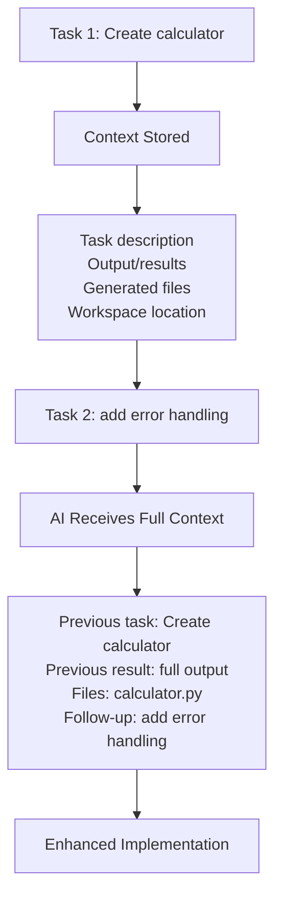

# 💬 Conversation Mode - Complete Guide

## Overview

Both the CLI and Web UI now support **intelligent conversation mode** where plain messages automatically continue from previous tasks, creating a natural, ChatGPT-like experience.

## 🎯 How It Works

### CLI - Smart Auto-Detection

The CLI automatically detects if your message should continue the previous task:

```bash
orchestrator (default): create a Python calculator
✓ Task completed!

# Plain message - CLI detects it should follow up
orchestrator (default): add error handling

💡 Detected as follow-up to previous task
✓ Error handling added!

# Or CLI asks you
orchestrator (default): write tests

Continue previous task?
Previous: create a Python calculator...
Continue (c), New task (n), or Cancel (x)? [c]: c
✓ Continuing previous task with context

✓ Tests added!
```

**Auto-detection triggers when:**
- Message is short (< 10 words)
- Contains keywords: add, fix, improve, change, update, also, now, then, etc.

**Otherwise:**
- CLI prompts you: Continue (c), New (n), or Cancel (x)?
- Your choice is remembered

### Web UI - Conversation Mode Toggle

The UI has a **Conversation Mode** checkbox:

**OFF (Default):**
- Each message starts a new task
- Fresh context every time

**ON:**
- Messages automatically continue previous task
- Full context preserved
- Natural chat-like flow

## 📋 Feature Comparison

| Feature | CLI | Web UI |
|---------|-----|--------|
| **Auto-follow-up** | ✅ Smart detection | ✅ Toggle checkbox |
| **User choice** | ✅ Prompt when unsure | ✅ Visual toggle |
| **Context preservation** | ✅ Automatic | ✅ Automatic |
| **Plain messages** | ✅ Yes | ✅ Yes |
| **Explicit follow-up** | ✅ `/followup` | ✅ Follow-up section |

## 🚀 Usage Examples

### Example 1: CLI Natural Conversation

```bash
$ ./ai-orchestrator interactive

> create a REST API for user management
✓ API created with CRUD endpoints

> add authentication
💡 Detected as follow-up to previous task
✓ JWT authentication added

> now add rate limiting
💡 Detected as follow-up to previous task
✓ Rate limiting implemented

> also add unit tests
💡 Detected as follow-up to previous task
✓ Comprehensive tests added
```

### Example 2: CLI with Prompts

```bash
> create a blog system
✓ Blog system created

> implement search functionality

Continue previous task?
Previous: create a blog system...
Continue (c), New task (n), or Cancel (x)? [c]: n
✓ Starting new task

✓ Standalone search created
```

### Example 3: Web UI Conversation Mode

1. **Complete first task:** "Create a calculator"
2. **Enable conversation mode** ☑️
3. **Type:** "add history tracking"
4. **Click** "Send Message"
5. System automatically continues with context
6. **Keep chatting** naturally

### Example 4: Web UI Mixed Mode

1. **Task:** "Build authentication system"
2. **Complete**
3. **Leave conversation mode OFF**
4. **Use Follow-up section** for quick additions
5. **Type new task** for unrelated work

## 🎨 UI Elements

### Conversation Mode Checkbox
- **Location:** Top-right of task input
- **Appears:** After first task completion
- **Label:** "Conversation mode"
- **Effect:** Changes "Execute Task" → "Send Message"

### Visual Indicators
- ✅ Green text: "Messages will continue from previous task"
- 🔵 Button changes to "Send Message" in conversation mode
- 💡 Hints show context awareness

### Follow-up Section
- **Separate green section** for quick follow-ups
- **Works independently** of conversation mode
- **Best for:** Single additions like "add tests"

## 🧠 Smart CLI Detection

### Keywords That Trigger Auto-Follow-Up

**Action words:**
- add, also, now, then, next
- additionally, improve, fix, change
- update, modify, make it, enhance

**Request words:**
- can you, please, try, would you

**Examples:**
```bash
# Auto-detected as follow-up ✓
> add tests
> also validate input
> now improve performance
> fix the bug
> make it faster
> can you add logging

# Prompts for confirmation
> create a different module
> build something else
> new feature request
```

## 🎯 When to Use What

### CLI: Use `/followup` When
- You want to be explicit
- Message doesn't have keywords
- You want to ensure continuation

### CLI: Use Plain Messages When
- Natural conversation flow
- Trust auto-detection
- Quick iterations

### UI: Enable Conversation Mode When
- Having a back-and-forth conversation
- Iterating on same feature
- Want ChatGPT-like experience

### UI: Use Follow-up Section When
- One-off additions
- Quick enhancements
- Don't want to change mode

### UI: Disable Conversation Mode When
- Working on multiple unrelated tasks
- Want explicit control
- Switching between projects

## 💡 Pro Tips

### CLI Tips

1. **Trust the detection** - It's smart!
   ```bash
   > create API
   > add auth         # Auto-detected ✓
   > add rate limit   # Auto-detected ✓
   ```

2. **Use keywords** for auto-follow-up
   ```bash
   > also add logging
   > now improve error handling
   ```

3. **Explicit when needed**
   ```bash
   > /followup add comprehensive tests
   ```

### UI Tips

1. **Toggle conversation mode** for iterative work
2. **Keep it ON** during a feature development session
3. **Turn OFF** when switching projects
4. **Use Ctrl+Enter** to execute quickly
5. **Follow-up section** works independently

## 📊 Behavior Matrix

### CLI Behavior

| Message Type | Has Previous Task | Action |
|-------------|-------------------|--------|
| `/followup add X` | Yes | Follow-up |
| `/followup add X` | No | Error message |
| `add tests` (< 10 words, keyword) | Yes | Auto follow-up |
| `add tests` | No | New task |
| `create new module` | Yes | Prompt user |
| `create new module` | No | New task |

### UI Behavior

| Conversation Mode | Action |
|-------------------|--------|
| OFF | Always new task |
| ON + Previous task | Follow-up |
| ON + No previous | New task (auto-disable) |

## 🔄 Context Flow

### What Gets Preserved



## 🎬 Real-World Scenarios

### Scenario 1: Feature Development

```bash
CLI Session:
> build user profile page
> add avatar upload
> add edit functionality
> add validation
> write tests
# All auto-detected as follow-ups
```

### Scenario 2: Bug Fixing

```bash
CLI Session:
> analyze authentication bug
> fix the race condition
> add logging for debugging
> verify the fix works
```

### Scenario 3: Mixed Work (UI)

1. Task: "Create dashboard" (conversation mode ON)
2. Message: "add charts"
3. Message: "add filters"
4. **Disable conversation mode**
5. New task: "Create user settings page"
6. **Enable conversation mode**
7. Continue iterating

## ⚠️ Important Notes

1. **Context Limit**: Last task only (not entire history)
2. **Clear Context**: Use `/reset` (CLI) or "Clear" button (UI)
3. **File Tracking**: All generated files preserved
4. **Workflow Persists**: Same workflow used for follow-ups

## 🔧 Technical Details

### CLI Detection Algorithm
```python
def _should_follow_up(message):
    if has_previous_task():
        if is_short(message) and has_keywords(message):
            return True  # Auto follow-up
        else:
            return prompt_user()  # Ask user
    return False  # New task
```

### UI Conversation Mode
```javascript
function handleExecute() {
  if (conversationMode && canFollowUp) {
    executeFollowUp(task)
  } else {
    executeTask()
  }
}
```

## 📚 Summary

**CLI:**
- ✅ Smart auto-detection of follow-ups
- ✅ Prompts when unsure
- ✅ `/followup` for explicit control
- ✅ Natural conversation flow

**UI:**
- ✅ Conversation mode toggle
- ✅ Separate follow-up section
- ✅ Visual indicators
- ✅ Flexible control

**Both:**
- ✅ Full context preservation
- ✅ File tracking
- ✅ Seamless iterations
- ✅ ChatGPT-like experience

**Ready to have natural conversations with your AI coding assistants!** 💬🚀
