# Features Documentation

## Table of Contents

- [Core Features](#core-features)
- [CLI Features](#cli-features)
- [Web UI Features](#web-ui-features)
- [Conversation Mode](#conversation-mode)
- [Workflow System](#workflow-system)
- [AI Agent Integration](#ai-agent-integration)
- [Session Management](#session-management)
- [File Management](#file-management)
- [Security Features](#security-features)
- [Monitoring & Metrics](#monitoring--metrics)
- [Advanced Features](#advanced-features)

## Core Features

### Multi-Agent Collaboration

The orchestrator coordinates multiple AI coding assistants to work together on complex tasks.

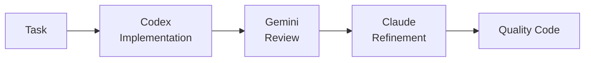

**Benefits:**
- **Diverse Perspectives**: Each AI has unique strengths
- **Quality Assurance**: Multiple review cycles
- **Best Practices**: Automated code review
- **Efficiency**: Parallel execution where possible

**Supported AI Agents:**
- **Claude Code** (Anthropic) - Refinement and documentation
- **OpenAI Codex** - Code implementation
- **Google Gemini** - Code review and analysis
- **GitHub Copilot** - Suggestions and alternatives

### Configurable Workflows

Define how agents collaborate for different scenarios.

| Workflow | Agents | Iterations | Use Case |
|----------|--------|------------|----------|
| **default** | Codex → Gemini → Claude | 3 | Production code with quality assurance |
| **quick** | Codex only | 1 | Fast prototyping |
| **thorough** | Codex → Copilot → Gemini → Claude → Gemini | 5 | Mission-critical code |
| **review-only** | Gemini → Claude | 2 | Existing code improvement |
| **document** | Claude → Gemini | 2 | Documentation generation |

**Custom Workflows:**
```yaml
workflows:
  custom:
    max_iterations: 4
    min_suggestions_threshold: 5
    steps:
      - agent: "codex"
        task: "implement"
      - agent: "gemini"
        task: "security_review"
      - agent: "claude"
        task: "refine"
```

## CLI Features

### Interactive Shell

<p align="center">
  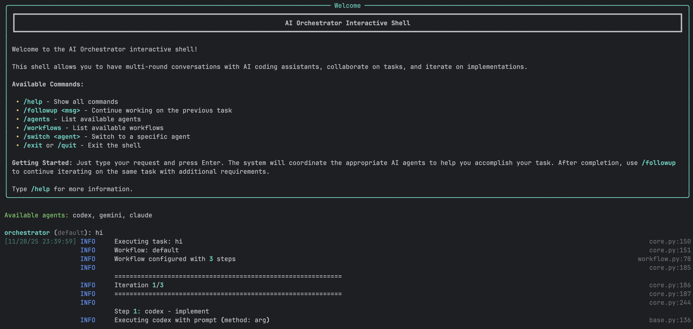
</p>

A powerful REPL-style interface for natural conversations with AI agents.

**Features:**
- ✅ Multi-round conversations with context preservation
- ✅ Smart follow-up detection
- ✅ Full readline support (arrow keys, history, tab completion)
- ✅ Session save/load
- ✅ Real-time progress indicators
- ✅ Colored output with Rich library
- ✅ Command history across sessions
- ✅ Auto-completion for commands and workflows

**Example Session:**

```bash
$ ./ai-orchestrator shell

orchestrator (default) > create a REST API for blog posts

✓ Task completed successfully!
📁 Generated Files:
  📄 api/blog.py
  📄 api/models.py
  📄 api/routes.py

Workspace: ./workspace

orchestrator (default) > add authentication with JWT

💡 Detected as follow-up to previous task
✓ Authentication added!
📁 Generated Files:
  📄 api/auth.py
  📄 api/middleware.py

orchestrator (default) > also add rate limiting

💡 Detected as follow-up to previous task
✓ Rate limiting implemented!

orchestrator (default) > /save blog-api-project
✓ Session saved to: sessions/blog-api-project.json

orchestrator (default) > /exit
Goodbye!
```

### CLI Commands

| Command | Description | Example |
|---------|-------------|---------|
| `/help` | Show all available commands | `/help` |
| `/followup <msg>` | Explicit follow-up to previous task | `/followup add tests` |
| `/agents` | List all available agents and status | `/agents` |
| `/workflows` | List all available workflows | `/workflows` |
| `/switch <agent>` | Switch to specific agent | `/switch claude` |
| `/workflow <name>` | Change current workflow | `/workflow thorough` |
| `/history` | Show conversation history | `/history` |
| `/context` | Show current context | `/context` |
| `/save [name]` | Save current session | `/save my-project` |
| `/load <name>` | Load saved session | `/load my-project` |
| `/reset` | Clear all context | `/reset` |
| `/info` | Show system information | `/info` |
| `/clear` | Clear screen | `/clear` |
| `/exit`, `/quit` | Exit the shell | `/exit` |

### One-Shot Mode

Execute single tasks without interactive shell:

```bash
# Basic usage
./ai-orchestrator run "Create a Python calculator"

# With workflow selection
./ai-orchestrator run "Build authentication system" --workflow default

# With options
./ai-orchestrator run "Refactor database layer" \
  --workflow thorough \
  --max-iterations 5 \
  --verbose

# Dry run to see execution plan
./ai-orchestrator run "Add error handling" --dry-run

# Custom output directory
./ai-orchestrator run "Generate CLI tool" --output ./my-output
```

### Smart Follow-Up Detection

The CLI automatically detects when messages should continue from previous tasks.

**Auto-Detected Keywords:**
- Action words: `add`, `also`, `now`, `then`, `next`, `improve`, `fix`, `change`, `update`
- Request words: `can you`, `please`, `try`, `would you`

**Behavior:**

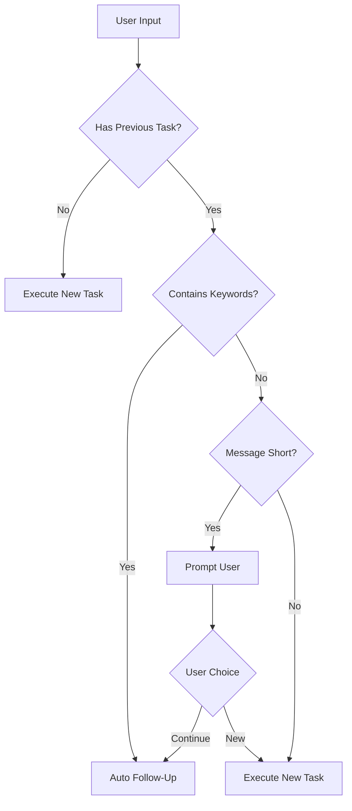

## Web UI Features

<p align="center">
  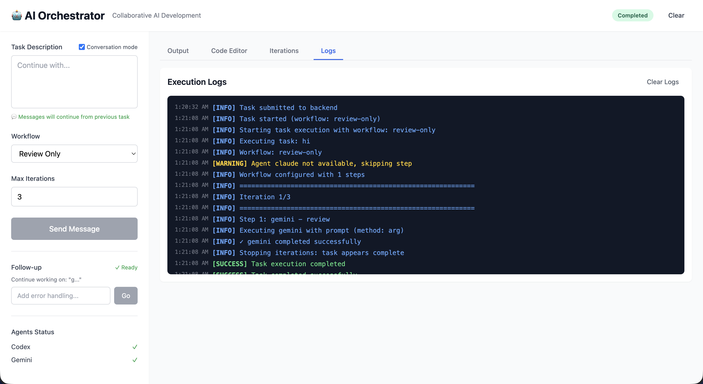
</p>

### Modern Interface

Built with Vue 3, the Web UI provides a rich visual experience:

**Technology Stack:**
- **Frontend**: Vue 3 (Composition API), Vite, TailwindCSS
- **State**: Pinia for reactive state management
- **Editor**: Monaco Editor (VS Code engine)
- **Real-time**: Socket.IO for live updates
- **Backend**: Flask with Flask-SocketIO

### Main Interface Components

**Left Sidebar:**
- Task input (multi-line textarea)
- Workflow selector dropdown
- Max iterations slider (1-10)
- Execute/Send Message button
- Agent status indicators (live)
- Generated files list (clickable)

**Main Content Area:**
- **Output Tab**: Full AI response with syntax highlighting
- **Code Editor Tab**: Monaco editor with VS Code features
- **Iterations Tab**: Detailed progress tracking

**Header:**
- Status badge (Idle/Running/Completed/Error)
- Conversation mode toggle
- Clear button

### Real-Time Features

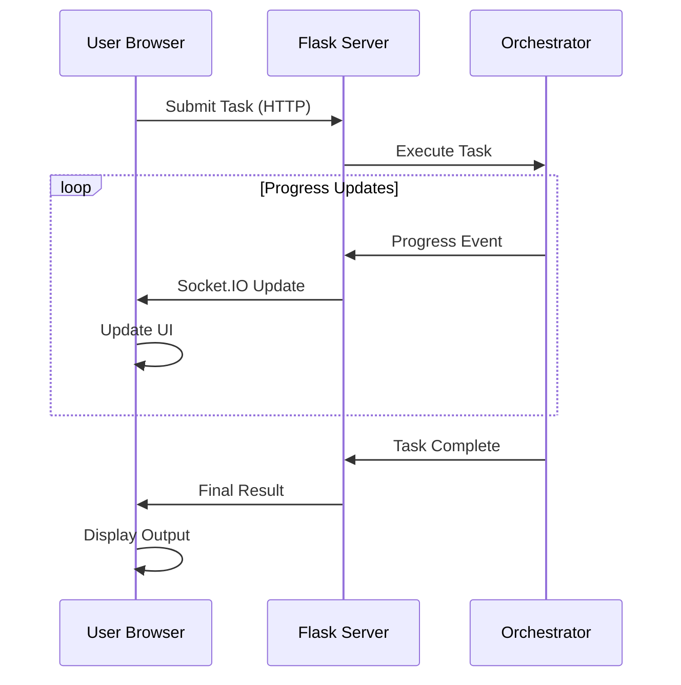

**Real-time Updates:**
- Agent status changes
- Progress indicators
- File creation notifications
- Error alerts
- Completion notifications

### Monaco Code Editor

Full-featured code editor integrated into the UI:

**Features:**
- Syntax highlighting for 100+ languages
- Line numbers and minimap
- Search and replace
- Multiple themes
- Keyboard shortcuts
- IntelliSense-style completion
- Error highlighting
- Code folding

**File Operations:**
- Open generated files with click
- Edit code in-place
- Download files individually
- Syntax-aware highlighting
- Auto-detection of language

### Conversation Mode Toggle

Enable ChatGPT-like continuous conversations:

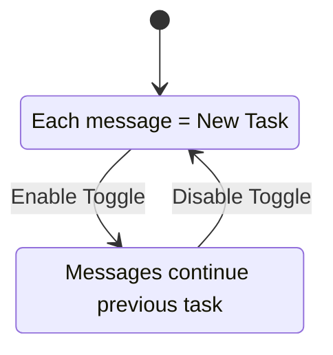

**When Enabled:**
- All messages automatically continue from previous task
- Button changes to "Send Message"
- Green indicator shows conversation is active
- Full context preserved across messages
- Visual hints show what you're continuing

**When Disabled:**
- Each message starts fresh task
- Button shows "Execute Task"
- No automatic context carryover

### Follow-Up Section

Separate green section for quick additions after task completion:

**Features:**
- Appears after any successful task
- Input box for follow-up message
- "Go" button to execute
- Works independently of conversation mode
- Shows previous task context

**Use Cases:**
- "add tests"
- "add error handling"
- "improve performance"
- "add documentation"

## Conversation Mode

### How It Works

**CLI Implementation:**
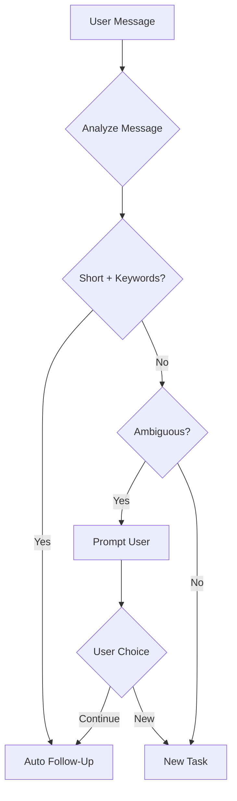

**UI Implementation:**
- Toggle checkbox controls mode
- Visual indicators show status
- Separate follow-up section
- Context preservation automatic

### Context Preservation

What gets preserved in conversation mode:

```yaml
context:
  previous_task: "create a REST API"
  previous_output: "Full AI response..."
  generated_files:
    - "api/routes.py"
    - "api/models.py"
  workspace: "./workspace"
  workflow: "default"
  timestamp: "2024-01-15T10:30:00Z"
```

### Best Practices

**Use Conversation Mode For:**
- ✅ Iterative feature development
- ✅ Multi-step refactoring
- ✅ Progressive enhancement
- ✅ Debug-and-fix cycles
- ✅ Building complex features

**Don't Use For:**
- ❌ Completely unrelated tasks
- ❌ Switching between projects
- ❌ One-off questions
- ❌ Starting fresh implementations

## Workflow System

### Workflow Execution Flow

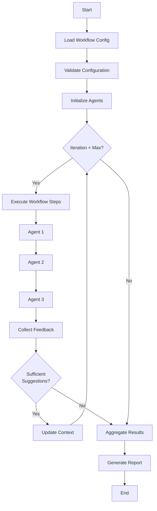

### Iteration Control

Workflows can iterate until quality thresholds are met:

**Iteration Triggers:**
- Review produces significant suggestions
- Code quality metrics below threshold
- Manual iteration request
- Maximum iterations not reached

**Stop Conditions:**
- Fewer than `min_suggestions_threshold` suggestions
- Maximum iterations reached
- All quality checks pass
- Manual stop requested

**Example:**
```yaml
settings:
  max_iterations: 3
  min_suggestions_threshold: 5
  quality_threshold: 0.8
```

## AI Agent Integration

### Agent Status Monitoring

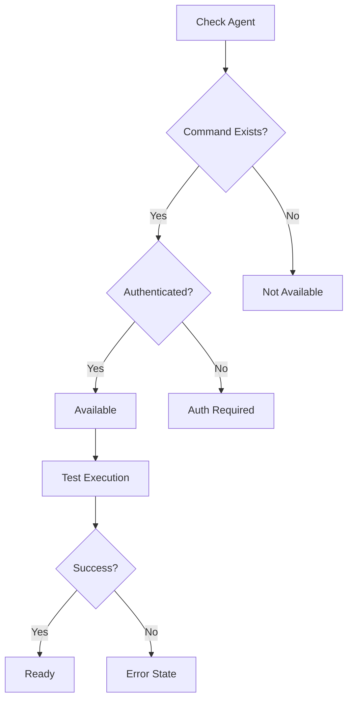

**Status Indicators:**
- ✅ **Available** - Ready to use
- ⚠️ **Auth Required** - Needs authentication
- ❌ **Not Found** - CLI not installed
- 🔴 **Error** - Configuration or execution error

### Agent Capabilities

**Codex (OpenAI):**
- Primary implementation agent
- Excellent at code generation
- Pattern recognition
- Quick iterations
- Best for: Initial implementations, boilerplate

**Gemini (Google):**
- Code review specialist
- SOLID principles analysis
- Security vulnerability detection
- Performance optimization
- Best for: Code review, architecture analysis

**Claude (Anthropic):**
- Refinement and improvement
- Documentation generation
- Code explanation
- Context-aware modifications
- Best for: Refinement, documentation

**Copilot (GitHub):**
- Alternative suggestions
- Multiple implementation options
- Pattern-based recommendations
- Best for: Ideation, alternatives

## Session Management

### Save and Load Sessions

Persist entire conversation contexts for later:

**What Gets Saved:**
- Complete conversation history
- All generated files
- Workspace state
- Active workflow
- Agent configurations
- Timestamps and metadata

**CLI Usage:**
```bash
# Save session
orchestrator > /save my-project

# Load session
./ai-orchestrator shell --load my-project

# Or within shell
orchestrator > /load my-project

# List saved sessions
./ai-orchestrator sessions
```

**File Format (JSON):**
```json
{
  "session_id": "uuid-here",
  "created_at": "2024-01-15T10:00:00Z",
  "workflow": "default",
  "conversation_history": [
    {
      "role": "user",
      "content": "create a REST API",
      "timestamp": "2024-01-15T10:00:00Z"
    },
    {
      "role": "assistant",
      "content": "API created...",
      "files": ["api.py", "models.py"],
      "timestamp": "2024-01-15T10:01:30Z"
    }
  ],
  "workspace": "./workspace",
  "metadata": {}
}
```

## File Management

### Workspace Organization

```
workspace/
├── session-uuid/
│   ├── api/
│   │   ├── routes.py
│   │   ├── models.py
│   │   └── __init__.py
│   ├── tests/
│   │   └── test_api.py
│   └── docs/
│       └── README.md
```

### File Tracking

The orchestrator tracks all generated files:

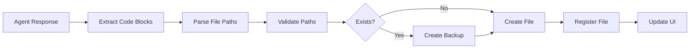

**Features:**
- Automatic file extraction from AI responses
- Backup of existing files
- Path validation and sanitization
- File registry for tracking
- Click-to-open in UI

### File Operations

**CLI:**
```bash
# Files listed after task completion
📁 Generated Files:
  📄 api/routes.py
  📄 api/models.py
  📄 tests/test_api.py

Workspace: ./workspace/session-abc123
```

**UI:**
- Click file to view in Monaco editor
- Edit and save changes
- Download individual files
- Syntax highlighting based on extension
- Line-by-line diff view

## Security Features

### Input Validation

All user inputs are validated and sanitized:

```python
class SecurityValidator:
    def validate_task(self, task: str) -> bool:
        # Command injection prevention
        if self._contains_shell_metacharacters(task):
            raise SecurityError("Potential command injection")

        # Path traversal prevention
        if self._contains_path_traversal(task):
            raise SecurityError("Path traversal detected")

        # Length validation
        if len(task) > MAX_TASK_LENGTH:
            raise ValidationError("Task too long")

        return True
```

**Protected Against:**
- Command injection
- Path traversal attacks
- SQL injection (if using database)
- XSS attacks in UI
- Malicious code execution

### Rate Limiting

Token bucket algorithm prevents abuse:

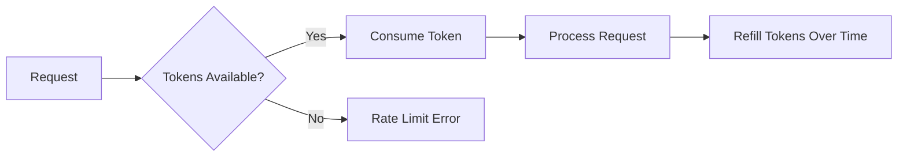

**Configuration:**
```yaml
rate_limiting:
  enabled: true
  requests_per_minute: 10
  burst_size: 20
  per_user: true
```

### Audit Logging

All security-relevant events are logged:

```python
logger.info(
    "security_event",
    event_type="task_execution",
    user_id="user-123",
    task_hash="abc...",
    timestamp="2024-01-15T10:00:00Z",
    success=True
)
```

**Logged Events:**
- Authentication attempts
- Authorization failures
- Rate limit violations
- Input validation failures
- Suspicious activities

## Monitoring & Metrics

### Prometheus Metrics

Comprehensive metrics for production monitoring:

**Task Metrics:**
```python
orchestrator_tasks_total
orchestrator_task_duration_seconds
orchestrator_task_failures_total
orchestrator_task_success_rate
```

**Agent Metrics:**
```python
orchestrator_agent_calls_total
orchestrator_agent_errors_total
orchestrator_agent_response_time_seconds
orchestrator_agent_availability
```

**System Metrics:**
```python
orchestrator_cache_hits_total
orchestrator_cache_misses_total
orchestrator_active_sessions
orchestrator_memory_usage_bytes
```

### Health Checks

**Endpoints:**
- `/health` - Overall system health
- `/ready` - Readiness for traffic
- `/metrics` - Prometheus metrics

**Health Check Response:**
```json
{
  "status": "healthy",
  "version": "1.0.0",
  "agents": {
    "claude": "available",
    "codex": "available",
    "gemini": "available"
  },
  "uptime_seconds": 3600,
  "active_sessions": 5
}
```

## Advanced Features

### Caching System

Multi-layer caching for performance:

**Cache Layers:**
1. **In-Memory** - Fast, 5-minute TTL
2. **File-Based** - Persistent, 24-hour TTL
3. **Distributed** - Redis (optional)

**Cache Strategy:**
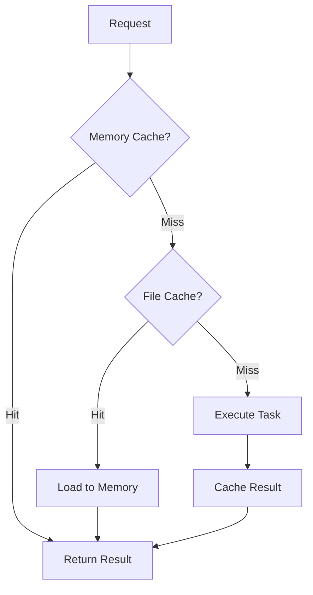

### Async Execution

Parallel execution where possible:

```python
async def execute_parallel_agents(agents, task):
    results = await asyncio.gather(
        *[agent.execute_async(task) for agent in agents],
        return_exceptions=True
    )
    return [r for r in results if not isinstance(r, Exception)]
```

### Retry Logic

Automatic retry with exponential backoff:

```python
@retry(
    stop=stop_after_attempt(3),
    wait=wait_exponential(multiplier=1, min=2, max=10),
    retry=retry_if_exception_type(TransientError)
)
def execute_with_retry(agent, task):
    return agent.execute(task)
```

### Circuit Breaker

Prevent cascading failures:

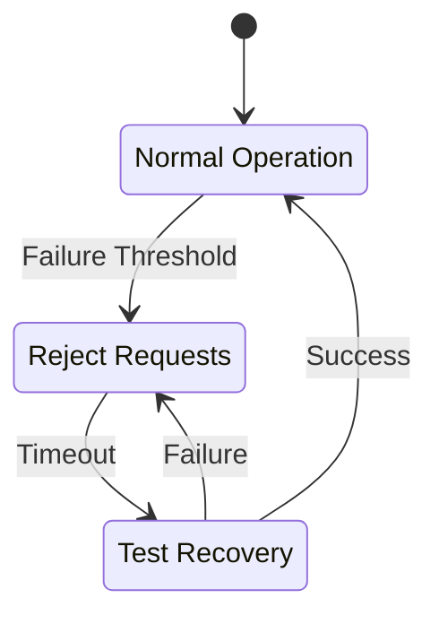

---

For more information:
- [Architecture Documentation](ARCHITECTURE.md)
- [Setup Guide](SETUP.md)
- [Adding Agents Guide](ADD_AGENTS.md)
