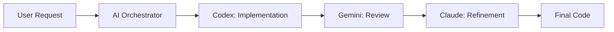
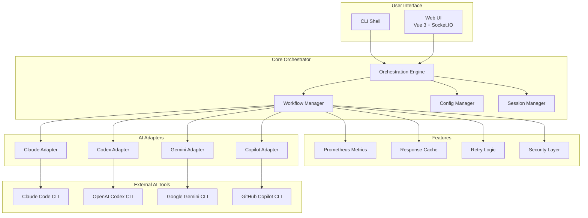
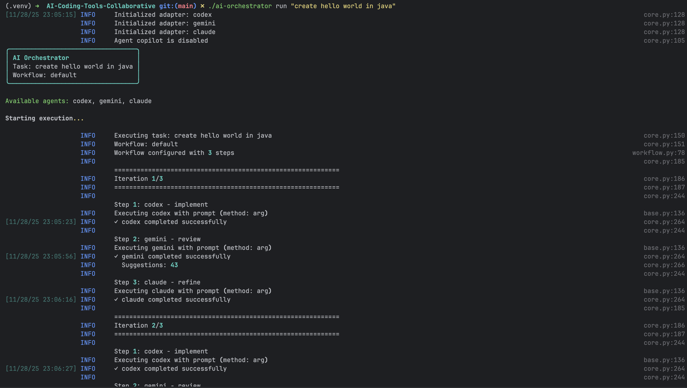

# AI Coding Tools Orchestrator


<div align="center">

**Production-ready orchestration system that coordinates multiple AI coding assistants (Claude, Codex, Gemini, Copilot) to collaborate on software development tasks**

[Features](#-features) • [Quick Start](#-quick-start) • [Documentation](#-documentation) • [Architecture](ARCHITECTURE.md) • [Contributing](#-contributing)

</div>

---

## 🎯 Overview

AI Coding Tools Orchestrator is an enterprise-grade system that enables multiple AI coding assistants to work together collaboratively. It provides a unified interface (CLI and Web UI) to coordinate Claude Code, OpenAI Codex, Google Gemini, and GitHub Copilot for complex software development tasks.

### How It Works



### System Architecture



<p align="center">
  
</p>

## ✨ Features

### Core Capabilities

- 🤝 **Multi-Agent Collaboration** - Coordinate multiple AI assistants in intelligent workflows
- 💬 **Interactive Shell** - REPL-style interface with natural conversation flow
- 🌐 **Web UI** - Modern Vue 3 interface with real-time updates and Monaco editor
- 📝 **Conversation Mode** - ChatGPT-like experience with context preservation
- 💾 **Session Management** - Save and restore conversation history
- ⚙️ **Configurable Workflows** - Define custom collaboration patterns (default, quick, thorough)
- 🔧 **Extensible Architecture** - Easy to add new AI agents

### Production-Ready Features

- 🛡️ **Security** - Input validation, rate limiting, secret management, audit logging
- 📊 **Monitoring** - Prometheus metrics, structured logging, health checks
- 🎯 **Reliability** - Retry logic, circuit breakers, graceful degradation
- ⚡ **Performance** - Async execution, caching, connection pooling
- 🔍 **Code Quality** - Type hints, comprehensive tests (>80% coverage), linting
- 🚢 **Deployment** - Docker, Kubernetes, systemd support
- 🔄 **CI/CD** - Automated testing and releases via GitHub Actions

<p align="center">
  
</p>

## 🚀 Quick Start

### Prerequisites

- Python 3.8 or higher
- At least one AI CLI tool installed (Claude Code, Codex, Gemini, or Copilot)
- Node.js 20+ (for Web UI)
- Docker (optional)

### Installation

```bash
# Clone the repository
git clone <repository-url>
cd AI-Coding-Tools-Collaborative

# Install dependencies
pip install -r requirements.txt

# Make CLI executable
chmod +x ai-orchestrator

# Verify installation
./ai-orchestrator --help
```

### Quick Test

```bash
# Start interactive shell
./ai-orchestrator shell

# Or run a one-shot task
./ai-orchestrator run "Create a Python calculator function" --workflow quick
```

## 💻 Usage

### Command Line Interface (CLI)

The CLI provides a powerful interactive shell with natural conversation flow:

```bash
# Start interactive shell
./ai-orchestrator shell

# Example session
orchestrator (default) > create a REST API for user management
✓ Task completed successfully!

orchestrator (default) > add JWT authentication
💡 Detected as follow-up to previous task
✓ Authentication added!

orchestrator (default) > also add rate limiting
💡 Detected as follow-up to previous task
✓ Rate limiting implemented!

orchestrator (default) > /save user-api-project
Session saved!
```

**CLI Features:**
- Smart auto-detection of follow-up messages
- Full context preservation across conversations
- Readline support (arrow keys, history, tab completion)
- Commands: `/help`, `/save`, `/load`, `/history`, `/agents`, `/workflows`

### Web UI

<p align="center">
  
</p>

Start the Web UI for a visual development experience:

```bash
# Terminal 1: Start backend
cd ui
python app.py

# Terminal 2: Start frontend
cd ui/frontend
npm install
npm run dev

# Or use the startup script
./start-ui.sh
```

Open http://localhost:3000

**UI Features:**
- Real-time progress tracking
- Monaco code editor (same as VS Code)
- Conversation mode toggle
- File management and downloads
- Syntax highlighting
- Iteration details view

### Available Workflows

| Workflow | Description | Use Case |
|----------|-------------|----------|
| **default** | Codex → Gemini → Claude | Production-quality code with full review cycle |
| **quick** | Codex only | Fast prototyping and iteration |
| **thorough** | Multi-agent with extra review | Mission-critical or security-sensitive code |
| **review-only** | Gemini → Claude | Analyzing and improving existing code |
| **document** | Claude → Gemini | Generating comprehensive documentation |

### CLI Commands

```bash
# Basic usage
./ai-orchestrator run "task description"
./ai-orchestrator shell

# With options
./ai-orchestrator run "task" --workflow thorough --max-iterations 5
./ai-orchestrator run "task" --verbose --dry-run

# Utility commands
./ai-orchestrator agents       # List available agents
./ai-orchestrator workflows    # List available workflows
./ai-orchestrator validate     # Validate configuration
./ai-orchestrator version      # Show version info
```

## 📁 Project Structure

```
AI-Coding-Tools-Collaborative/
├── ai-orchestrator           # Main CLI entry point
├── orchestrator/             # Core orchestration engine
│   ├── core.py              # Main orchestrator logic
│   ├── workflow.py          # Workflow management
│   ├── shell.py             # Interactive shell/REPL
│   ├── config_manager.py    # Configuration handling
│   ├── metrics.py           # Prometheus metrics
│   ├── security.py          # Security utilities
│   ├── cache.py             # Caching layer
│   └── retry.py             # Retry logic
├── adapters/                 # AI agent adapters
│   ├── base.py              # Base adapter interface
│   ├── claude_adapter.py    # Claude Code integration
│   ├── codex_adapter.py     # OpenAI Codex integration
│   ├── gemini_adapter.py    # Google Gemini integration
│   ├── copilot_adapter.py   # GitHub Copilot integration
│   └── cli_communicator.py  # Robust CLI communication
├── ui/                       # Web UI
│   ├── app.py               # Flask backend with Socket.IO
│   ├── frontend/            # Vue 3 frontend
│   │   ├── src/
│   │   │   ├── App.vue
│   │   │   ├── components/
│   │   │   └── stores/      # Pinia state management
│   │   └── package.json
│   └── requirements.txt
├── config/
│   └── agents.yaml          # Agent and workflow configuration
├── tests/                    # Comprehensive test suite
│   ├── test_orchestrator.py
│   ├── test_adapters.py
│   ├── test_integration.py
│   └── test_shell.py
├── docs/                     # Documentation
│   ├── images/              # Screenshots
│   ├── ARCHITECTURE.md
│   ├── FEATURES.md
│   ├── SETUP.md
│   └── ADD_AGENTS.md
├── deployment/               # Deployment configs
│   ├── kubernetes/
│   └── systemd/
├── Dockerfile
├── docker-compose.yml
├── Makefile                  # Development commands
├── pyproject.toml           # Project metadata
├── requirements.txt
└── README.md
```

## 🧪 Testing

```bash
# Run all tests
make test

# Run with coverage
make test-coverage

# Run specific test suite
pytest tests/test_adapters.py -v

# Run integration tests
pytest tests/ -v -m integration

# Run security tests
make security
```

## 🐳 Docker Deployment

```bash
# Build and run
docker-compose up -d

# With monitoring stack
docker-compose --profile monitoring up -d

# Build image
docker build -t ai-orchestrator:latest .

# Run container
docker run -it --rm \
  -v $(pwd)/config:/app/config \
  -v $(pwd)/workspace:/app/workspace \
  ai-orchestrator:latest
```

## 📊 Monitoring

Prometheus metrics are exposed on port 9090 at `/metrics`:

- `orchestrator_tasks_total` - Total tasks executed
- `orchestrator_task_duration_seconds` - Task execution time
- `orchestrator_agent_calls_total` - Agent invocations
- `orchestrator_agent_errors_total` - Agent error count
- `orchestrator_cache_hits_total` - Cache performance

Health checks available at:
- `/health` - Overall health status
- `/ready` - Readiness probe

## 🔧 Development

```bash
# Install development dependencies
make install-dev

# Format code
make format

# Run linters
make lint

# Type checking
make type-check

# Security scan
make security

# Run all checks
make all
```

### Pre-commit Hooks

```bash
# Install hooks
pre-commit install

# Run on all files
pre-commit run --all-files
```

## 📚 Documentation

- **[ARCHITECTURE.md](ARCHITECTURE.md)** - System architecture and design patterns
- **[FEATURES.md](FEATURES.md)** - Comprehensive feature documentation
- **[SETUP.md](SETUP.md)** - Installation and setup guide
- **[ADD_AGENTS.md](ADD_AGENTS.md)** - Guide for adding new AI agents
- **[CONTRIBUTING.md](CONTRIBUTING.md)** - Contribution guidelines

## 🤝 Contributing

We welcome contributions! Please see [CONTRIBUTING.md](CONTRIBUTING.md) for guidelines.

### Quick Contribution Guide

1. Fork the repository
2. Create a feature branch: `git checkout -b feature/your-feature`
3. Make your changes with tests
4. Run checks: `make all`
5. Commit: `git commit -m "feat: add amazing feature"`
6. Push and create a Pull Request

## 🔒 Security

For security issues, please email security@example.com. Do not open public issues for security vulnerabilities.

See [SECURITY.md](SECURITY.md) for our security policy and best practices.

## 📄 License

This project is licensed under the MIT License - see [LICENSE](LICENSE) for details.

## 🙏 Acknowledgments

Built with:
- [Click](https://click.palletsprojects.com/) - CLI framework
- [Rich](https://rich.readthedocs.io/) - Terminal formatting
- [Pydantic](https://docs.pydantic.dev/) - Data validation
- [Vue 3](https://vuejs.org/) - UI framework
- [Flask](https://flask.palletsprojects.com/) - Backend framework
- [Monaco Editor](https://microsoft.github.io/monaco-editor/) - Code editor
- [Prometheus](https://prometheus.io/) - Metrics and monitoring

## 💬 Support

- **Documentation**: [docs/](docs/)
- **Issues**: [GitHub Issues](https://github.com/your-org/ai-orchestrator/issues)
- **Discussions**: [GitHub Discussions](https://github.com/your-org/ai-orchestrator/discussions)

## ⭐ Star History

If you find this project useful, please consider giving it a star!

---

<div align="center">

**Made with ❤️ for the AI development community**

[⬆ Back to Top](#ai-coding-tools-orchestrator)

</div>
