# AI Coding Tools Orchestrator and Agentic Team Runtime


<div align="center">

**Six independent systems — an AI Orchestrator, an Agentic Team runtime, AI Collaboration task continuity, an MCP Server, a Context Dashboard, and Graphify (project-to-graph intelligence engine) — that help Claude, Codex, Cursor, Gemini, Copilot, Ollama, and llama.cpp collaborate on software development tasks.**

[Overview](#overview) | [Architecture](#architecture) | [Agentic Infrastructure](#agentic-infrastructure) | [System Comparison](#system-comparison) | [Features](#feature-highlights) | [Quick Start](#quick-start) | [Project Structure](#project-structure) | [Configuration](#configuration) | [Deployment](#deployment) | [Testing](#testing) | [MCP Server](#mcp-server-optional----model-context-protocol)

</div>

---

## Overview

AI Coding Tools ships **six independent systems** in a single repository:

1. The **Orchestrator** runs step-based workflows where AI agents execute tasks in sequence (implement, review, refine).
2. The **Agentic Team** runs a free-communication runtime where role-based agents (Project Manager, Architect, Developer, QA, DevOps) discuss a task in turns until the team lead declares the work complete.
3. **Graphify** turns any project directory into a queryable knowledge graph — classes, functions, imports, call graphs, and design rationale stored in a local SQLite database with FTS5 search.
4. **AI Collaboration** preserves local coding-task context across Claude Code, Codex, Cursor, Gemini CLI, and GitHub Copilot CLI using portable skills, native hooks, and a standalone MCP server.
5. The **MCP Server** bridges both engines to IDE-based AI assistants.
6. The **Context Dashboard** visualizes the graph memory. Each runtime carries its own adapters, configuration, UI, and CLI; AI Collaboration is also standalone and imports from neither runtime.

Beyond the core engines, we provide a complete **Agentic Infrastructure** that empowers AI agents:

- **9 Specialized Agents** for web, backend, security, DevOps, AI/ML, database, mobile, performance, and documentation
- **22 Reusable Skills** across development, testing, security, DevOps, AI/ML, and documentation
- **34+ MCP Tools** for code analysis, security scanning, testing, DevOps, and context memory
- **Graph Context System** with hybrid search (BM25 + semantic) for persistent memory and learning
- **Domain Rules** encoding best practices for security, database, API design, performance, and AI/ML

> [!TIP]
> Quickstart with the Orchestrator for structured workflows, or the Agentic Team for open-ended collaboration. Both systems benefit from the shared agentic infrastructure and context memory. See [QUICKSTART.md](QUICKSTART.md) for quick setup instructions to get started in ~2 minutes. Or, see [#quick-start](#quick-start) below for a detailed walkthrough.

## Agentic Infrastructure

We provide a rich agentic infrastructure that both the Orchestrator and Agentic Team utilize to empower their AI agents with specialized knowledge, reusable skills, powerful tools, and persistent context memory. This infrastructure is designed to be modular and extensible, allowing for easy addition of new agents, skills, tools, and context nodes as the system evolves.


```mermaid
graph TB
    subgraph "🧠 Agentic Infrastructure"
        direction LR

        subgraph AGENTS["Specialized Agents (9)"]
            WEB[Web Frontend]
            API[Backend API]
            SEC[Security]
            OPS[DevOps]
            ML[AI/ML]
            DB[Database]
        end

        subgraph SKILLS["Skills Library (22)"]
            DEV[Development]
            TEST[Testing]
            SECS[Security]
            DEVOPS[DevOps]
            AIML[AI/ML]
            DOCS[Documentation]
        end

        subgraph TOOLS["MCP Tools (34+)"]
            CODE[Code Analysis]
            SCAN[Security Scan]
            TTOOLS[Testing]
            DTOOLS[DevOps]
            CTX[Context Memory]
        end

        subgraph CONTEXT["Graph Context"]
            GRAPH[(Graph Store)]
            SEARCH[Hybrid Search]
            EMBED[Embeddings]
        end
    end

    AGENTS --> SKILLS
    SKILLS --> TOOLS
    TOOLS --> CONTEXT
```

| Component | Count | Description |
|-----------|-------|-------------|
| **Specialized Agents** | 9 | Domain experts for web, backend, security, DevOps, AI/ML, database, mobile, performance, documentation |
| **Skills** | 22 | Reusable task templates across 6 categories |
| **MCP Tools** | 34+ | Code analysis, security scanning, testing, DevOps, context memory |
| **Node Types** | 10 | Conversation, Task, Mistake, Pattern, Decision, CodeSnippet, Preference, File, Concept, Project |
| **Edge Types** | 12 | RELATED_TO, CAUSED_BY, FIXED_BY, SIMILAR_TO, DEPENDS_ON, etc. |

> [!IMPORTANT]
> 📚 **[Click for Full Agentic Infrastructure Documentation](AGENTIC_INFRA.md)**

### Context System

Both the Orchestrator and Agentic Team maintain **independent** graph-based context databases for persistent memory and cross-session learning. A unified Context Dashboard aggregates both stores for visualization.

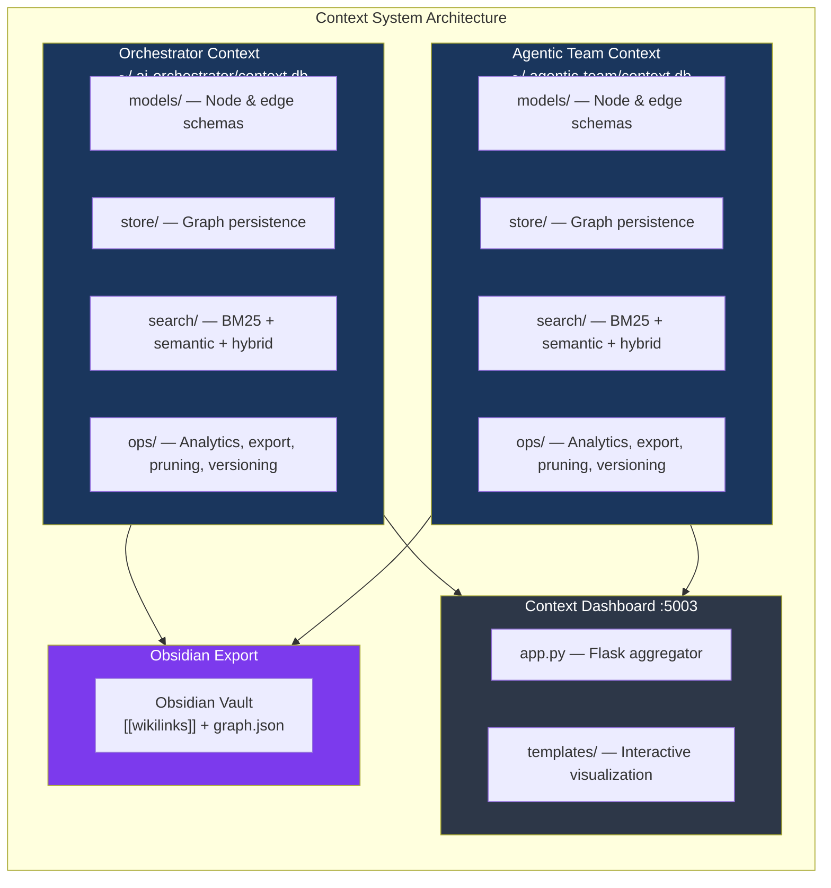
```mermaid
graph TB
    subgraph "Context System Architecture"
        direction TB

        subgraph ORCH_CTX["Orchestrator Context<br/>~/.ai-orchestrator/context.db"]
            OM[models/ — Node & edge schemas]
            OS[store/ — Graph persistence]
            OX[search/ — BM25 + semantic + hybrid]
            OO[ops/ — Analytics, export, pruning, versioning]
        end

        subgraph TEAM_CTX["Agentic Team Context<br/>~/.agentic-team/context.db"]
            TM[models/ — Node & edge schemas]
            TS[store/ — Graph persistence]
            TX[search/ — BM25 + semantic + hybrid]
            TO[ops/ — Analytics, export, pruning, versioning]
        end

        subgraph DASH["Context Dashboard :5003"]
            APP[app.py — Flask aggregator]
            VIZ[templates/ — Interactive visualization]
        end

        subgraph OBS_OUT["Obsidian Export"]
            OBS_V["Obsidian Vault<br/>[[wikilinks]] + graph.json"]
        end
    end

    ORCH_CTX --> DASH
    TEAM_CTX --> DASH
    ORCH_CTX --> OBS_OUT
    TEAM_CTX --> OBS_OUT

    style ORCH_CTX fill:#1a365d,color:#fff
    style TEAM_CTX fill:#1a365d,color:#fff
    style DASH fill:#2d3748,color:#fff
    style OBS_OUT fill:#7C3AED,color:#fff
```

**Node Types** — 10 types of knowledge stored in the graph:

| Node Type | Description |
|-----------|-------------|
| **Conversation** | Past chat sessions with full message history |
| **Task** | Completed tasks with outcomes, agent used, and duration |
| **Mistake** | Errors with corrections and prevention strategies |
| **Pattern** | Reusable code patterns and best practices |
| **Decision** | Architectural decisions with rationale and trade-offs |
| **CodeSnippet** | Useful code fragments with language and context |
| **Preference** | Learned user preferences (tools, style, workflows) |
| **File** | Source files with language, size, and framework metadata |
| **Concept** | Abstract concepts and domain knowledge |
| **Project** | Registered project roots with scan metadata |

**Edge Types** — 12 relationship types connecting nodes:

| Edge Type | Description |
|-----------|-------------|
| `RELATED_TO` | General semantic relationship |
| `CAUSED_BY` | Causal chain (mistake → root cause) |
| `FIXED_BY` | Resolution link (mistake → fix) |
| `SIMILAR_TO` | Similarity link (patterns, tasks) |
| `DEPENDS_ON` | Dependency relationship |
| `PRECEDED_BY` | Temporal ordering (earlier event) |
| `FOLLOWED_BY` | Temporal ordering (later event) |
| `LEARNED_FROM` | Knowledge derivation (preference → conversation) |
| `USED_IN` | Usage relationship (pattern → task) |
| `REFERENCES` | Cross-reference between nodes |
| `DERIVED_FROM` | Derived knowledge (snippet → pattern) |
| `EVOLVED_INTO` | Evolution tracking (v1 pattern → v2) |

**Hybrid Search** combines three retrieval strategies via Reciprocal Rank Fusion (RRF):

1. **BM25** — Keyword-based search using term frequency–inverse document frequency
2. **Semantic** — Embedding-based similarity using vector cosine distance
3. **Hybrid** — Fused ranking of BM25 + semantic results using RRF for best-of-both-worlds retrieval

### Project-Scoped Context Graphs

Both systems support **project-scoped context graphs** for full portability. When a user points the system at their project directory, agents automatically scan and build a rich context graph of the codebase.

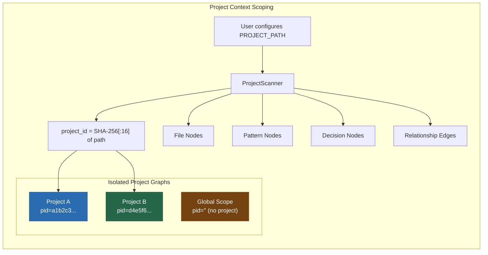
```mermaid
graph TB
    subgraph "Project Context Scoping"
        direction TB

        USER[User configures PROJECT_PATH] --> SCAN[ProjectScanner]
        SCAN --> PID["project_id = SHA-256[:16] of path"]

        subgraph "Isolated Project Graphs"
            P1["Project A<br/>pid=a1b2c3..."]
            P2["Project B<br/>pid=d4e5f6..."]
            P3["Global Scope<br/>pid='' (no project)"]
        end

        PID --> P1 & P2
        SCAN --> FILES[File Nodes]
        SCAN --> PATTERNS[Pattern Nodes]
        SCAN --> DECISIONS[Decision Nodes]
        SCAN --> EDGES[Relationship Edges]
    end

    style P1 fill:#2b6cb0,stroke:#2c5282,color:#fff
    style P2 fill:#276749,stroke:#22543d,color:#fff
    style P3 fill:#744210,stroke:#975a16,color:#fff
```

**Key features:**
- **Deterministic IDs**: `project_id` is a SHA-256 prefix of the normalized absolute path — idempotent and reproducible
- **Multi-project isolation**: Each project gets its own graph partition; queries filter by `project_id`
- **Global scope**: Nodes with `project_id=""` are universal (patterns, reference knowledge) — shared across all projects
- **Automatic scanning**: `ProjectScanner` detects languages, frameworks, file structure, and config patterns
- **Portability**: Set `PROJECT_PATH` environment variable or `settings.project_path` in config YAML — the system handles the rest
- **Incremental updates**: `rescan_project()` rebuilds the graph atomically; `delete_project_graph()` cleanly removes all project nodes

> [!TIP]
> **Auto-seeding:** Run `scripts/seed_context_graphs.py` to populate both context databases with generic reference knowledge (patterns, mistakes, decisions) on first use. Seed data contains no hallucination-prone fake tasks or conversations — only universally applicable best practices.

> [!NOTE]
> **Context Dashboard:** Launch with `python -m context_dashboard` (port 5003) to visualize both context graphs, inspect nodes/edges, and search across all stored knowledge. See [`context_dashboard/README.md`](context_dashboard/README.md) for details.

> [!TIP]
> **Obsidian Export:** Export any graph as an [Obsidian](https://obsidian.md) vault for offline interactive exploration. Graphify: `graphify export obsidian <path>`. Context systems: `ContextExporter.export_obsidian()`. Each vault includes `[[wikilinks]]`, typed folders, YAML frontmatter, and pre-configured `.obsidian/graph.json` color groups. See [GRAPHIFY.md](GRAPHIFY.md#obsidian-vault-export), [ORCHESTRATOR.md](ORCHESTRATOR.md#obsidian-vault-export), and [AGENTIC_TEAM.md](AGENTIC_TEAM.md#obsidian-vault-export).

### Skills Library & Agent Definitions

AI coding agents are enhanced with specialized role definitions, reusable skills, and domain rules that are automatically loaded based on context.

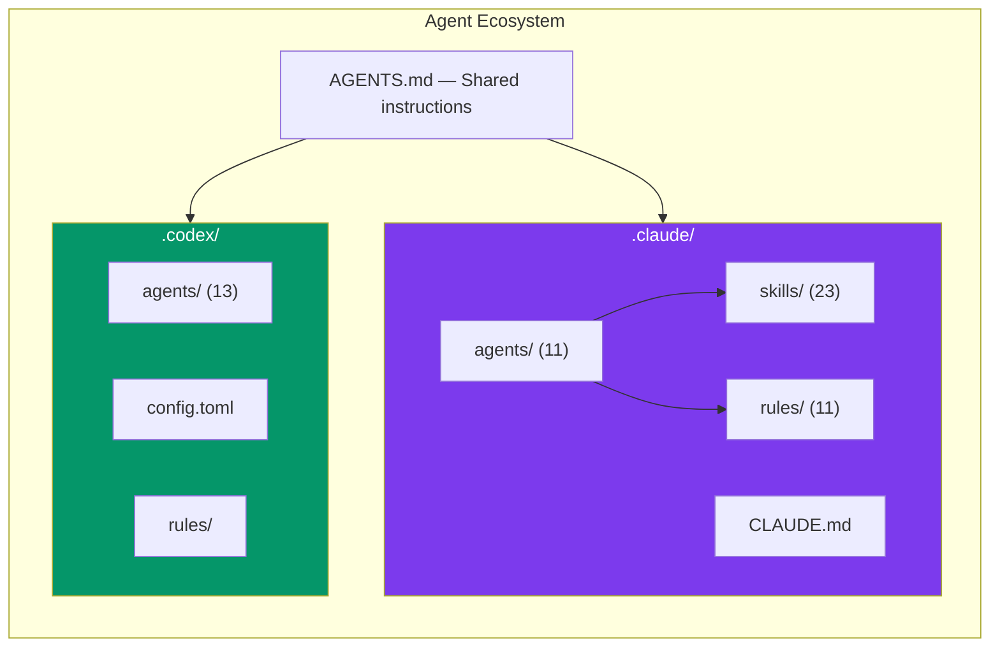
```mermaid
graph LR
    subgraph "Agent Ecosystem"
        direction TB

        subgraph CLAUDE[".claude/"]
            CA["agents/ (11)"]
            CS["skills/ (23)"]
            CR["rules/ (11)"]
            CC[CLAUDE.md]
        end

        subgraph CODEX[".codex/"]
            XA["agents/ (13)"]
            XC[config.toml]
            XR[rules/]
        end

        AGENTS_MD[AGENTS.md — Shared instructions]
    end

    CA --> CS
    CA --> CR
    AGENTS_MD --> CLAUDE
    AGENTS_MD --> CODEX

    style CLAUDE fill:#7c3aed,color:#fff
    style CODEX fill:#059669,color:#fff
```

**Claude Agents** — 11 specialized agents in `.claude/agents/`:

| Agent | File | Domain |
|-------|------|--------|
| Web Frontend | `web-frontend.md` | React, Vue, CSS, accessibility, responsive design |
| Backend API | `backend-api.md` | REST, GraphQL, databases, Flask/FastAPI |
| Security Specialist | `security-specialist.md` | OWASP, vulnerability analysis, secure coding |
| DevOps Infrastructure | `devops-infrastructure.md` | Docker, Kubernetes, CI/CD, cloud |
| AI/ML Engineer | `ai-ml-engineer.md` | ML pipelines, embeddings, LLM integration |
| Database Architect | `database-architect.md` | Schema design, query optimization, migrations |
| Mobile Developer | `mobile-developer.md` | iOS, Android, React Native, Flutter |
| Performance Engineer | `performance-engineer.md` | Profiling, load testing, optimization |
| Documentation Writer | `documentation-writer.md` | API docs, architecture, tutorials |
| Code Reviewer | `code-reviewer.md` | Code quality, best practices, PR reviews |
| Test Runner | `test-runner.md` | Test execution, coverage, failure diagnosis |

**Codex Agents** — 13 specialized agents in `.codex/agents/`:

| Agent | File | Domain |
|-------|------|--------|
| Code Reviewer | `code-reviewer.toml` | Code quality and review automation |
| Explorer | `explorer.toml` | Codebase exploration and research |
| Security Specialist | `security-specialist.toml` | Security auditing and vulnerability scanning |
| Web Frontend | `web-frontend.toml` | Frontend development and UI patterns |
| DevOps Infrastructure | `devops-infrastructure.toml` | Infrastructure and deployment automation |
| Implementer | `implementer.toml` | Feature implementation and coding |
| Database Architect | `database-architect.toml` | Database design and optimization |
| Performance Engineer | `performance-engineer.toml` | Performance profiling and optimization |
| Test Runner | `test-runner.toml` | Test suite execution and diagnosis |
| AI/ML Engineer | `ai-ml-engineer.toml` | ML pipelines and AI system design |
| Backend API | `backend-api.toml` | Backend services and API development |
| Documentation Writer | `documentation-writer.toml` | Technical documentation |
| Mobile Developer | `mobile-developer.toml` | Mobile application development |

**Skills Library** — 24 reusable skill templates in `.claude/skills/` across 7 categories:

| Category | Count | Skills |
|----------|-------|--------|
| **Development** | 6 | `react-components`, `rest-api-design`, `python-async`, `database-queries`, `graphql-development`, `error-handling` |
| **Testing** | 4 | `unit-testing`, `integration-testing`, `test-driven-development`, `performance-testing` |
| **Security** | 4 | `input-validation`, `authentication`, `secure-coding`, `vulnerability-assessment` |
| **DevOps** | 3 | `docker-containerization`, `ci-cd-pipelines`, `kubernetes-deployment` |
| **AI/ML** | 3 | `embeddings-retrieval`, `llm-integration`, `rag-pipeline` |
| **Documentation** | 3 | `api-documentation`, `architecture-docs`, `code-documentation` |
| **Context** | 1 | `context-graph-builder` |

> Four additional standalone skills (`context-graph-builder`, `generate-reports`, `health-check`, `run-tests`) provide operational task automation.

**Domain Rules** — 11 rule files in `.claude/rules/` encoding best practices:

| Rule | File | Enforces |
|------|------|----------|
| Adapters | `adapters.md` | Adapter pattern, base class contracts |
| API Design | `api-design.md` | RESTful conventions, versioning, error formats |
| Testing | `testing.md` | Pytest patterns, coverage requirements, fixtures |
| Performance | `performance.md` | Profiling, caching, async patterns |
| Config | `config.md` | YAML config, environment variables, validation |
| AI/ML | `ai-ml.md` | Model integration, embeddings, prompt patterns |
| Observability | `observability.md` | Logging, metrics, health checks |
| Frontend | `frontend.md` | Component patterns, accessibility, state management |
| CI/CD | `ci-cd.md` | Pipeline design, deployment gates, rollback |
| Security | `security.md` | Input validation, auth, secrets management |
| Database | `database.md` | Schema design, migrations, query safety |

> [!NOTE]
> Agents automatically inherit access to all skills and rules in their scope. When Claude Code is invoked with a specialized agent (e.g., `@security-specialist`), it loads the agent definition, relevant skills, and applicable domain rules to provide expert-level guidance.

### Configuration Files

| File | Purpose |
|------|---------|
| `.claude/CLAUDE.md` | Main instructions for Claude Code — imports `AGENTS.md` and sets project context |
| `.claude/settings.json` | Claude project settings (permissions, model preferences) |
| `.codex/config.toml` | Codex project configuration |
| `.codex/agents/*.toml` | Codex agent role definitions with system prompts |
| `AGENTS.md` | Shared instructions read by all AI coding agents (Codex, Gemini CLI, etc.) |
| `AGENTIC_INFRA.md` | Full documentation of the agentic infrastructure |

## Architecture

### High-Level Overview

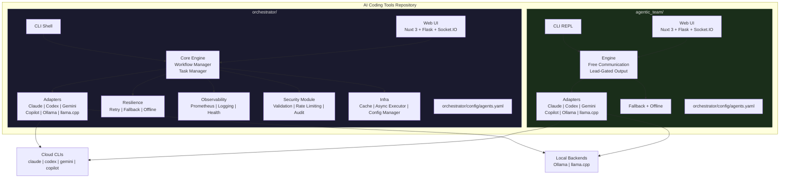
```mermaid
graph TD
    subgraph Repository["AI Coding Tools Repository"]
        direction TB

        subgraph Orchestrator["orchestrator/"]
            O_CLI["CLI Shell"]
            O_UI["Web UI<br/>Nuxt 3 + Flask + Socket.IO"]
            O_CORE["Core Engine<br/>Workflow Manager<br/>Task Manager"]
            O_ADAPT["Adapters<br/>Claude | Codex | Gemini<br/>Copilot | Ollama | llama.cpp"]
            O_RESIL["Resilience<br/>Retry | Fallback | Offline"]
            O_OBS["Observability<br/>Prometheus | Logging | Health"]
            O_SEC["Security Module<br/>Validation | Rate Limiting | Audit"]
            O_INFRA["Infra<br/>Cache | Async Executor | Config Manager"]
            O_CONF["orchestrator/config/agents.yaml"]
        end

        subgraph AgenticTeam["agentic_team/"]
            A_CLI["CLI REPL"]
            A_UI["Web UI<br/>Nuxt 3 + Flask + Socket.IO"]
            A_ENGINE["Engine<br/>Free Communication<br/>Lead-Gated Output"]
            A_ADAPT["Adapters<br/>Claude | Codex | Gemini<br/>Copilot | Ollama | llama.cpp"]
            A_FALLBACK["Fallback + Offline"]
            A_CONF["orchestrator/config/agents.yaml"]
        end
    end

    O_CLI --> O_CORE
    O_UI --> O_CORE
    O_CORE --> O_ADAPT
    O_CORE --> O_RESIL
    O_CORE --> O_OBS
    O_CORE --> O_SEC
    O_CORE --> O_INFRA
    O_ADAPT --> ExtCloud["Cloud CLIs<br/>claude | codex | gemini | copilot"]
    O_ADAPT --> ExtLocal["Local Backends<br/>Ollama | llama.cpp"]

    A_CLI --> A_ENGINE
    A_UI --> A_ENGINE
    A_ENGINE --> A_ADAPT
    A_ENGINE --> A_FALLBACK
    A_ADAPT --> ExtCloud
    A_ADAPT --> ExtLocal

    style Orchestrator fill:#1a1a2e,stroke:#16213e,color:#e0e0e0
    style AgenticTeam fill:#1a2e1a,stroke:#162e16,color:#e0e0e0
```

### Orchestrator Workflow Execution

The Orchestrator processes tasks through a configurable pipeline of AI agents. Each step in a workflow maps to a specific agent and role.

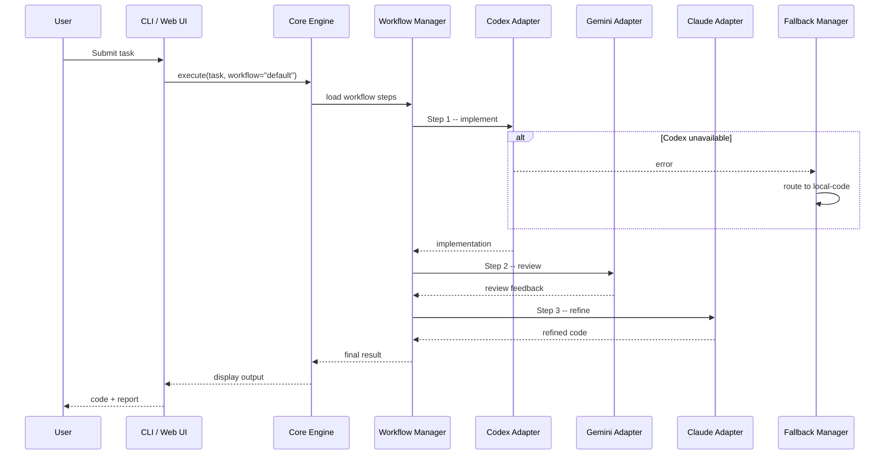
```mermaid
sequenceDiagram
    participant User
    participant CLI as CLI / Web UI
    participant Engine as Core Engine
    participant WF as Workflow Manager
    participant Codex as Codex Adapter
    participant Gemini as Gemini Adapter
    participant Claude as Claude Adapter
    participant FB as Fallback Manager

    User->>CLI: Submit task
    CLI->>Engine: execute(task, workflow="default")
    Engine->>WF: load workflow steps

    WF->>Codex: Step 1 -- implement
    alt Codex unavailable
        Codex-->>FB: error
        FB->>FB: route to local-code
    end
    Codex-->>WF: implementation

    WF->>Gemini: Step 2 -- review
    Gemini-->>WF: review feedback

    WF->>Claude: Step 3 -- refine
    Claude-->>WF: refined code

    WF-->>Engine: final result
    Engine-->>CLI: display output
    CLI-->>User: code + report
```

### Agentic Team Communication Flow

The Agentic Team uses free role-to-role communication. Agents speak in turns, address each other by role, and the team lead decides when the task is complete.

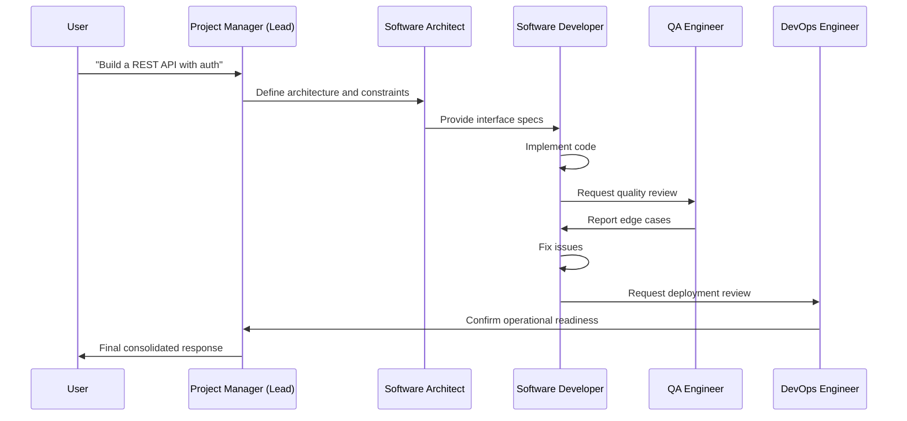
```mermaid
sequenceDiagram
    participant User
    participant PM as Project Manager (Lead)
    participant Arch as Software Architect
    participant Dev as Software Developer
    participant QA as QA Engineer
    participant DevOps as DevOps Engineer

    User->>PM: "Build a REST API with auth"
    PM->>Arch: Define architecture and constraints
    Arch->>Dev: Provide interface specs
    Dev->>Dev: Implement code
    Dev->>QA: Request quality review
    QA->>Dev: Report edge cases
    Dev->>Dev: Fix issues
    Dev->>DevOps: Request deployment review
    DevOps->>PM: Confirm operational readiness
    PM->>User: Final consolidated response
```

### Adapter Resolution Flow

Both systems resolve which AI backend to use at runtime. The adapter layer abstracts cloud CLIs and local model servers behind a common interface.

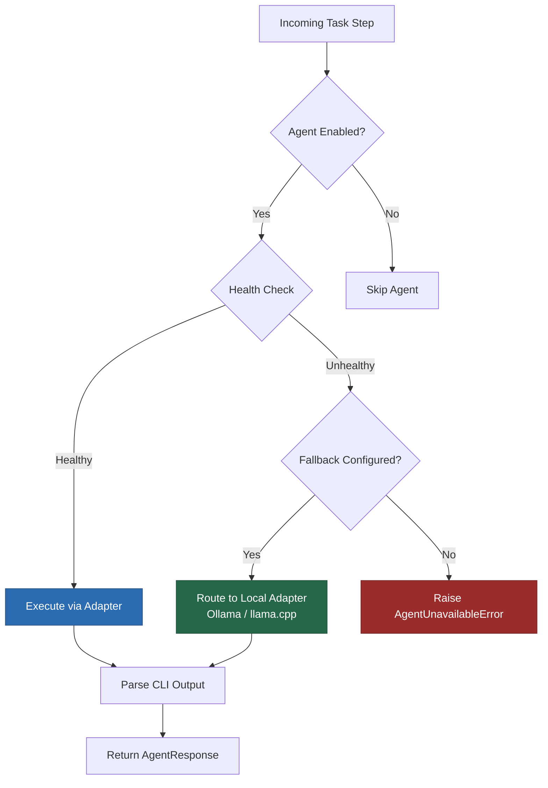
```mermaid
flowchart TD
    REQ[Incoming Task Step] --> CHECK{Agent Enabled?}
    CHECK -->|Yes| HEALTH{Health Check}
    CHECK -->|No| SKIP[Skip Agent]

    HEALTH -->|Healthy| EXEC[Execute via Adapter]
    HEALTH -->|Unhealthy| FB{Fallback Configured?}

    FB -->|Yes| LOCAL[Route to Local Adapter<br/>Ollama / llama.cpp]
    FB -->|No| ERR[Raise AgentUnavailableError]

    EXEC --> PARSE[Parse CLI Output]
    LOCAL --> PARSE
    PARSE --> RESULT[Return AgentResponse]

    style EXEC fill:#2b6cb0,stroke:#2c5282,color:#fff
    style LOCAL fill:#276749,stroke:#22543d,color:#fff
    style ERR fill:#9b2c2c,stroke:#742a2a,color:#fff
```

### Local model execution semantics and limitation

Local models are deeply integrated for routing, offline mode, and fallback, but they are **not direct workspace editors** in the current implementation.

| Path | How it runs | Direct file edits |
|---|---|---|
| Cloud CLI adapters (Codex/Claude/Gemini/Copilot) | CLI process + workspace execution path | Yes (tool-dependent) |
| Local adapters (Ollama/llama.cpp/OpenAI-compatible) | HTTP prompt-completion (`/api/generate` or `/v1/completions`) | No (text output only) |

Best use for local models: offline drafting, review feedback, and cloud-to-local fallback continuity.

> [!CAUTION]
> While it is possible to make local LLMs directly edit files (e.g., via a `file-editor` tool), this approach is currently disabled to prevent unintended destructive changes. Local adapters are advisory — they provide text output that the Orchestrator can use to inform the next steps, but they do not have direct write access to the workspace. This design choice prioritizes safety and predictability while still leveraging local models for their strengths in drafting and feedback. The hard part is not feasibility, it’s safety and reliability: permissions, diff constraints, validation/tests before write, rollback, and preventing bad edits.

### Technology Stack Overview

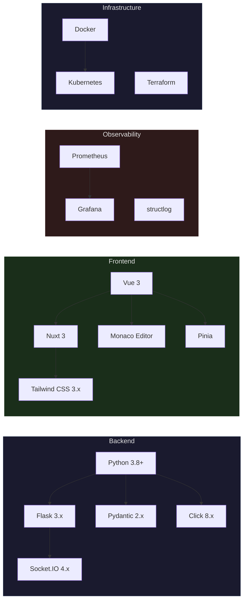
```mermaid
graph LR
    subgraph Backend
        PY[Python 3.8+]
        FL[Flask 3.x]
        SIO[Socket.IO 4.x]
        PD[Pydantic 2.x]
        CL[Click 8.x]
    end

    subgraph Frontend
        VUE[Vue 3]
        NUXT[Nuxt 3]
        TW[Tailwind CSS 3.x]
        MON[Monaco Editor]
        PIN[Pinia]
    end

    subgraph Observability
        PROM[Prometheus]
        GRAF[Grafana]
        SL[structlog]
    end

    subgraph Infrastructure
        DOCK[Docker]
        K8S[Kubernetes]
        TF[Terraform]
    end

    PY --> FL --> SIO
    PY --> PD
    PY --> CL
    VUE --> NUXT --> TW
    VUE --> MON
    VUE --> PIN
    PROM --> GRAF
    DOCK --> K8S

    style Backend fill:#1a1a2e,stroke:#16213e,color:#e0e0e0
    style Frontend fill:#1a2e1a,stroke:#162e16,color:#e0e0e0
    style Observability fill:#2e1a1a,stroke:#2e1616,color:#e0e0e0
    style Infrastructure fill:#1a1a2e,stroke:#16213e,color:#e0e0e0
```

## System Comparison

The two systems serve different collaboration models. Choose based on your use case.

| Dimension | Orchestrator (`orchestrator/`) | Agentic Team (`agentic_team/`) |
|---|---|---|
| **Collaboration model** | Step-based pipeline (sequential) | Free role-to-role communication (turns) |
| **Agent identity** | Tool names (codex, gemini, claude) | Roles (PM, Architect, Developer, QA, DevOps) |
| **Control flow** | Dynamic metrics-based planner or workflow YAML step order | Team lead (PM) gates completion dynamically |
| **When to use** | Dynamic planning, or repeatable pipelines: implement, review, refine | Open-ended tasks needing discussion and consensus |
| **CLI entry point** | `ai-orchestrator shell` | `ai-orchestrator agentic-shell` |
| **Web UI port** | `:5001` | `:5002` |
| **Config file** | `orchestrator/config/agents.yaml` | `agentic_team/config/agents.yaml` |
| **Built-in workflows** | Dynamic planner (metrics-based routing), plus 7 static (default, quick, thorough, review-only, document, offline-default, hybrid) | N/A (turn-based, no fixed pipeline) |
| **Fallback strategy** | Per-step cloud-to-local routing | Independent fallback manager |
| **Observability** | Prometheus metrics, structured logging, health probes, report generation | Health and readiness probes |
| **Security module** | Input validation, rate limiting, audit logging | N/A (inherits from adapter layer) |
| **Shared code** | None | None |

## Feature Highlights

### Orchestrator (`orchestrator/`)

| Category | Features |
|---|---|
| **Workflows** | 7 built-in workflows (default, quick, thorough, review-only, document, offline-default, hybrid); define custom ones in YAML |
| **Agents** | Claude, Codex, Gemini, Copilot (cloud); Ollama, llama.cpp (local) |
| **CLI** | Interactive REPL shell, one-shot commands, context-aware follow-ups, readline support |
| **Web UI** | Nuxt 3 + Vue 3 frontend, Flask + Socket.IO backend, Monaco code editor, Pinia state management |
| **Local model behavior** | Local adapters are advisory (text output); direct file edits come from CLI-backed agents |
| **Resilience** | Retry with exponential backoff, circuit breakers, cloud-to-local fallback, offline detection |
| **Observability** | Prometheus metrics, structured logging via structlog, health and readiness probes |
| **Reports** | Execution summaries, agent performance, workflow analytics, config audits, HTML dashboard with Chart.js charts |
| **Security** | Input validation, rate limiting, secret management, audit logging |
| **Infra** | Async executor, response caching, connection pooling, config manager |

### Agentic Team (`agentic_team/`)

| Category | Features |
|---|---|
| **Runtime** | Free role-to-role communication, configurable turn limits, lead-gated final responses |
| **Roles** | Project Manager, Software Architect, Software Developer, QA Engineer, DevOps Engineer |
| **CLI** | Dedicated REPL (`agentic-shell`) with `--max-turns` and `--offline` flags |
| **Web UI** | Dedicated Nuxt 3 + Flask UI with Config Studio, real-time turn streaming, team communication view |
| **Local model behavior** | Local adapters contribute role outputs and fallback text, but do not directly write files |
| **Fallback** | Independent fallback manager and offline detector |
| **Configuration** | Separate `agents.yaml` with `agentic_team.roles` section for role-to-agent mapping |

### AI Collaboration (`AI-Collaboration-Skills/`)

| Category | Features |
|---|---|
| **Continuity** | Tasks, provider sessions, normalized events, checkpoints, test history, and live Git state |
| **Hosts** | Claude Code, Codex, Cursor, Gemini CLI, and GitHub Copilot CLI |
| **Portable layer** | Agent Plugins 1.0 manifest, five Agent Skills, and ten MCP tools |
| **Passive capture** | Host-native lifecycle hooks with fail-open behavior and no model invocation |
| **Storage** | Private local SQLite store plus SHA-256 content-addressed gzip objects |
| **Privacy** | Recursive credential redaction, payload size bounds, no network service |
| **Boundary** | Zero imports from `orchestrator/`, `agentic_team/`, or the root MCP server |

See [`AI-Collaboration-Skills/README.md`](AI-Collaboration-Skills/README.md) for installation and usage.

### Graphify (`graphify/`)

| Category | Features |
|---|---|
| **Analysis** | Python AST (classes, functions, imports, calls, decorators, docstrings), JS/TS, Go, Rust, Java, C++, Markdown, YAML/JSON/TOML |
| **Graph** | SQLite + FTS5, WAL mode, schema migrations (v1→v2→v3), thread-local connections, context manager |
| **Search** | Full-text search, node explanation, path finding (BFS), community detection, god node analysis, complexity hotspots |
| **Cache** | SHA-256 content-addressable cache, incremental scans (only changed files) |
| **Export** | JSON, DOT (Graphviz), Markdown, GraphML, interactive HTML (vis.js), **Obsidian vault** |
| **API** | Flask REST API with CORS, structured error handling, metrics/snapshot/diff endpoints |
| **Operations** | File watching (watchdog + polling), graph snapshots & diffing, scan metrics collection |
| **Security** | Path traversal protection, input sanitization, bounded parameters, no debug mode |

## Quick Start

### Prerequisites

- **Operating System**: Linux, macOS, or Windows (WSL recommended)
- **Python**: 3.8 or higher
- **Node.js**: 20+ (for Web UI)
- **Memory**: Minimum 4GB RAM
- **Disk Space**: 1GB for installation + workspace
- **Network**: Required for AI CLI tools and updates
- **Claude Code**: Installed, setup, and signed in on your machine (Required for any workflows using Claude Code - if you run `claude` in terminal and it works, you're good)
- **OpenAI Codex**: Installed and authenticated (if using Codex agent, try running `codex` and see if it responds)
- **Google Gemini CLI**: Installed and authenticated (if using Gemini agent, try `gemini --version` to verify)
- **GitHub Copilot CLI**: Installed and authenticated (if using Copilot agent, try `copilot --version` to verify)
- **Llama.cpp or Ollama**: If using local LLM agents, ensure they are installed and configured properly (try running `ollama list` or `llamacpp --help` to verify)
- **Optional**: Docker and Docker Compose for containerized setup

### Install

```bash
git clone https://github.com/hoangsonww/AI-Agents-Orchestrator.git
cd AI-Agents-Orchestrator

python3 -m venv venv
source venv/bin/activate   # Windows: venv\Scripts\activate

pip install -r requirements.txt
chmod +x ai-orchestrator
```

### Run the Orchestrator

```bash
# Interactive shell
./ai-orchestrator shell

# One-shot task
./ai-orchestrator run "Create a Python REST API" --workflow default

# Start the Web UI
make run-ui
# Then open http://localhost:5001
```

### Run the Agentic Team

```bash
# Interactive REPL
./ai-orchestrator agentic-shell

# With options
./ai-orchestrator agentic-shell --max-turns 16 --offline

# Start the Web UI
make run-agentic-ui
# Then open http://localhost:5002
```

### Verify Installation

```bash
./ai-orchestrator --help        # Show all commands
./ai-orchestrator agents        # List available agents
./ai-orchestrator workflows     # List available workflows
./ai-orchestrator validate      # Validate configuration
```

## Project Structure

```
AI-Coding-Tools/
|
|-- .claude/                         # Claude Code agentic infrastructure
|   |-- CLAUDE.md                    # Main Claude instructions (imports AGENTS.md)
|   |-- settings.json                # Project settings and permissions
|   |-- agents/                      # 11 specialized agent definitions
|   |   |-- web-frontend.md
|   |   |-- backend-api.md
|   |   |-- security-specialist.md
|   |   |-- devops-infrastructure.md
|   |   |-- ai-ml-engineer.md
|   |   |-- database-architect.md
|   |   |-- mobile-developer.md
|   |   |-- performance-engineer.md
|   |   |-- documentation-writer.md
|   |   |-- code-reviewer.md
|   |   +-- test-runner.md
|   |-- skills/                      # 23 reusable skill templates
|   |   |-- development/             # 6 skills (react, REST, async, DB, GraphQL, errors)
|   |   |-- testing/                 # 4 skills (unit, integration, TDD, perf)
|   |   |-- security/                # 4 skills (validation, auth, secure-coding, vuln)
|   |   |-- devops/                  # 3 skills (Docker, CI/CD, K8s)
|   |   |-- ai-ml/                   # 3 skills (embeddings, LLM, RAG)
|   |   |-- documentation/           # 3 skills (API docs, arch docs, code docs)
|   |   |-- generate-reports/        # Standalone: report generation
|   |   |-- health-check/            # Standalone: system health checks
|   |   |-- run-tests/               # Standalone: test suite execution
|   |   +-- context-graph-builder/   # Standalone: context graph operations
|   +-- rules/                       # 11 domain rule files
|       |-- adapters.md
|       |-- api-design.md
|       |-- testing.md
|       |-- performance.md
|       |-- config.md
|       |-- ai-ml.md
|       |-- observability.md
|       |-- frontend.md
|       |-- ci-cd.md
|       |-- security.md
|       +-- database.md
|
|-- .codex/                          # Codex agentic infrastructure
|   |-- config.toml                  # Codex project configuration
|   |-- agents/                      # 13 specialized agent definitions (.toml)
|   |   |-- code-reviewer.toml
|   |   |-- explorer.toml
|   |   |-- security-specialist.toml
|   |   |-- web-frontend.toml
|   |   |-- devops-infrastructure.toml
|   |   |-- implementer.toml
|   |   |-- database-architect.toml
|   |   |-- performance-engineer.toml
|   |   |-- test-runner.toml
|   |   |-- ai-ml-engineer.toml
|   |   |-- backend-api.toml
|   |   |-- documentation-writer.toml
|   |   +-- mobile-developer.toml
|   |-- hooks/                       # Git hook integrations
|   +-- rules/                       # Codex-specific rules
|
|-- AI-Collaboration-Skills/         # Standalone cross-agent task continuity plugin
|   |-- plugin.json                  # Agent Plugins 1.0 portable manifest
|   |-- mcp.json                     # Portable stdio MCP server
|   |-- skills/                      # Resume, history, status, checkpoint, handoff
|   |-- adapters/                    # Claude, Codex, and Cursor native hooks/config
|   |-- ai_collaboration/            # Dependency-free Python core
|   |-- hooks/                       # Shared ingest dispatcher + Gemini hooks
|   |-- com.github.copilot/          # Copilot-specific lifecycle hooks
|   +-- tests/                       # Standalone continuity test suite
|
|-- mcp_server/                      # MCP server (FastMCP 3.x) — 34+ tools
|   |-- server.py                    # Server entry point + core tools
|   |-- engines.py                   # Engine adapters for both systems
|   |-- repl.py                      # Interactive REPL mode
|   |-- tools/                       # Tool modules by category
|   |   |-- orchestrator_tools.py    # Orchestrator execution tools
|   |   |-- agentic_team_tools.py    # Agentic team execution tools
|   |   |-- shared_tools.py          # Shared utility tools
|   |   |-- code_analysis.py         # 4 code analysis tools
|   |   |-- security_tools.py        # 4 security scanning tools
|   |   |-- testing_tools.py         # 4 testing tools
|   |   |-- devops_tools.py          # 5 DevOps tools
|   |   +-- context_tools.py         # 7 context memory tools
|   +-- resources/                   # MCP resource definitions
|
|-- orchestrator/                    # Self-contained orchestrator system
|   |-- __init__.py
|   |-- adapters/                    # AI agent adapters
|   |   |-- base.py                  # Abstract base adapter
|   |   |-- claude_adapter.py        # Claude Code CLI
|   |   |-- codex_adapter.py         # OpenAI Codex CLI
|   |   |-- gemini_adapter.py        # Google Gemini CLI
|   |   |-- copilot_adapter.py       # GitHub Copilot CLI
|   |   |-- ollama_adapter.py        # Ollama local models
|   |   |-- llama_cpp_adapter.py     # llama.cpp / OpenAI-compatible
|   |   +-- cli_communicator.py      # Robust CLI subprocess handling
|   |-- core/                        # Core orchestration logic
|   |   |-- engine.py                # Main orchestration engine
|   |   |-- workflow.py              # Workflow definitions and runner
|   |   |-- task_manager.py          # Task lifecycle management
|   |   +-- exceptions.py            # Custom exception hierarchy
|   |-- resilience/                  # Fault tolerance
|   |   |-- retry.py                 # Retry with exponential backoff
|   |   |-- fallback.py              # Cloud-to-local fallback routing
|   |   +-- offline.py               # Offline detection
|   |-- observability/               # Monitoring, logging, and reports
|   |   |-- metrics.py               # Prometheus metrics
|   |   |-- logging_config.py        # Structured logging setup
|   |   |-- health.py                # Health and readiness probes
|   |   +-- report_generator.py      # Execution, performance, and HTML reports
|   |-- security_module/             # Security layer
|   |   +-- security.py              # Validation, rate limiting, audit
|   |-- infra/                       # Infrastructure utilities
|   |   |-- cache.py                 # Response caching
|   |   |-- async_executor.py        # Async task execution
|   |   +-- config_manager.py        # Configuration loading
|   |-- cli/                         # CLI interface
|   |   +-- shell.py                 # Interactive REPL shell
|   |-- context/                     # Graph-based context memory
|   |   |-- memory_manager.py        # High-level memory API
|   |   |-- models/                  # Node and edge schemas
|   |   |   +-- schemas.py
|   |   |-- store/                   # Graph persistence layer
|   |   |   +-- graph_store.py
|   |   |-- search/                  # Search engines
|   |   |   |-- bm25_index.py        # BM25 keyword search
|   |   |   |-- embeddings.py        # Embedding generation
|   |   |   |-- hybrid_search.py     # Hybrid BM25 + semantic
|   |   |   +-- advanced_search.py   # Advanced query support
|   |   +-- ops/                     # Operational utilities
|   |       |-- analytics.py         # Graph analytics
|   |       |-- export.py            # Data export
|   |       |-- pruning.py           # Node/edge pruning
|   |       |-- versioning.py        # Version tracking
|   |       +-- project_scanner.py   # Project directory scanning
|   |-- config/
|   |   +-- agents.yaml              # Agents, workflows, settings
|   |-- ui/                          # Web UI
|   |   |-- app.py                   # Flask + Socket.IO backend
|   |   |-- frontend/                # Nuxt 3 + Vue 3 + Tailwind
|   |   |-- static/
|   |   +-- templates/
|   +-- README.md                    # Orchestrator-specific docs
|
|-- agentic_team/                    # Self-contained agentic team system
|   |-- __init__.py
|   |-- engine.py                    # Role-based communication engine
|   |-- shell.py                     # Agentic team REPL
|   |-- decision_parser.py           # Turn decision parsing
|   |-- config_utils.py              # Config loading utilities
|   |-- constants.py                 # Shared constants
|   |-- fallback.py                  # Independent fallback manager
|   |-- offline.py                   # Independent offline detector
|   |-- adapters/                    # Own copy of AI agent adapters
|   |   |-- base.py
|   |   |-- claude_adapter.py
|   |   |-- codex_adapter.py
|   |   |-- gemini_adapter.py
|   |   |-- copilot_adapter.py
|   |   |-- ollama_adapter.py
|   |   |-- llama_cpp_adapter.py
|   |   +-- cli_communicator.py
|   |-- context/                     # Independent graph-based context memory
|   |   |-- memory_manager.py        # High-level memory API
|   |   |-- models/                  # Node and edge schemas
|   |   |-- store/                   # Graph persistence layer
|   |   |-- search/                  # BM25 + FTS5 hybrid search
|   |   +-- ops/                     # Analytics, export, pruning, project scanning
|   |-- config/
|   |   +-- agents.yaml              # Agents, roles, team settings
|   |-- ui/                          # Dedicated Web UI
|   |   |-- app.py                   # Flask + Socket.IO backend
|   |   |-- frontend/                # Nuxt 3 + Vue 3 + Tailwind
|   |   |-- static/
|   |   +-- templates/
|   +-- README.md                    # Agentic team-specific docs
|
|-- tests/                           # Unified test suite
|   |-- conftest.py
|   |-- test_orchestrator.py
|   |-- test_adapters.py
|   |-- test_adapter_execution.py
|   |-- test_agentic_team_engine.py
|   |-- test_agentic_ui_backend.py
|   |-- test_integration.py
|   |-- test_functional_e2e.py
|   |-- test_enterprise_hardening.py
|   |-- test_production_hardening.py
|   +-- ...
|
|-- reports/                         # Generated reports (JSON + HTML dashboard)
|   |-- INDEX.json                   # Report catalog
|   |-- exec_*.json                  # Per-task execution summaries
|   |-- perf_*.json                  # Agent performance analytics
|   |-- workflow_*.json              # Workflow-level analytics
|   |-- health_*.json                # System health snapshots
|   |-- config_*.json                # Configuration audits
|   +-- dashboard_*.html             # Interactive HTML dashboard with charts
|
|-- deployment/                      # Deployment configurations
|   |-- kubernetes/
|   |-- azure/
|   |-- systemd/
|   |-- load-balancer/
|   +-- scripts/
|
|-- docs/                            # Documentation
|   |-- images/                      # Screenshots
|   |-- orchestrator-architecture.md
|   |-- orchestrator-api-reference.md
|   |-- agentic-team-architecture.md
|   |-- agentic-team-api-reference.md
|   |-- configuration-guide.md
|   |-- testing-guide.md
|   |-- security.md
|   +-- offline-mode.md
|
|-- examples/                        # Usage examples
|   |-- orchestrator/
|   +-- agentic_team/
|
|-- context_dashboard/               # Unified context visualization (port 5003)
|   |-- app.py                       # Flask app aggregating both context stores
|   |-- templates/
|   |   +-- dashboard.html           # Interactive graph visualization
|   +-- README.md                    # Dashboard-specific docs
|
|-- scripts/                         # Helper scripts
|   |-- install.sh
|   |-- start-ui.sh
|   |-- start-agentic-ui.sh
|   |-- start-mcp-server.sh
|   |-- start-all.sh
|   |-- seed_context_graphs.py
|   |-- health-check.sh
|   |-- format.sh
|   |-- lint.sh
|   +-- test.sh
|
|-- ai-orchestrator                  # Main CLI entry point
|-- Dockerfile                       # Multi-stage production image
|-- docker-compose.yml               # Both UIs + monitoring stack
|-- Makefile                         # Development commands
|-- pyproject.toml                   # Project metadata and tool config
|-- requirements.txt                 # Python dependencies
|-- AGENTS.md                        # Shared instructions for all AI coding agents
|-- AGENTIC_INFRA.md                 # Full agentic infrastructure documentation
|-- SETUP.md                         # Installation and setup guide
|-- ARCHITECTURE.md
|-- FEATURES.md
|-- AGENTIC_TEAM.md
|-- OFFLINE_MODE.md
|-- DEPLOYMENT.md
+-- LICENSE
```

> [!IMPORTANT]
> **Key design decision:** `orchestrator/` and `agentic_team/` are fully self-contained. Each carries its own `adapters/`, `config/`, and `ui/` directories. There are no shared root-level `adapters/`, `ui/`, or `config/` directories. The two systems share zero code and zero imports.

## Configuration

Both systems read their configuration from their own `orchestrator/config/agents.yaml` file. The files follow the same schema but are independent.

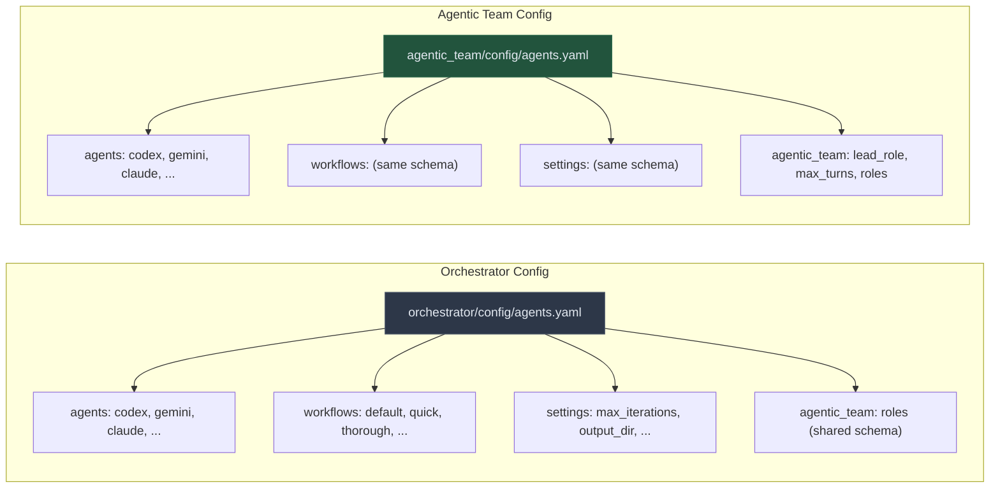
```mermaid
graph LR
    subgraph Orchestrator Config
        OC["orchestrator/config/agents.yaml"]
        OC --> OA["agents: codex, gemini, claude, ..."]
        OC --> OW["workflows: default, quick, thorough, ..."]
        OC --> OS["settings: max_iterations, output_dir, ..."]
        OC --> OAT["agentic_team: roles (shared schema)"]
    end

    subgraph Agentic Team Config
        AC["agentic_team/config/agents.yaml"]
        AC --> AA["agents: codex, gemini, claude, ..."]
        AC --> AW["workflows: (same schema)"]
        AC --> AS["settings: (same schema)"]
        AC --> AAT["agentic_team: lead_role, max_turns, roles"]
    end

    style OC fill:#2d3748,stroke:#4a5568,color:#e2e8f0
    style AC fill:#22543d,stroke:#276749,color:#e2e8f0
```

### Available Workflows

| Workflow | Pipeline | Use Case |
|---|---|---|
| `default` | Codex --> Gemini --> Claude | Production-quality code with full review |
| `quick` | Codex only | Fast prototyping |
| `thorough` | Codex --> Copilot --> Gemini --> Claude --> Gemini | Mission-critical code |
| `review-only` | Gemini --> Claude | Analyzing existing code |
| `document` | Claude --> Gemini | Documentation generation |
| `offline-default` | local-code --> local-instruct | Local-only, no cloud dependency |
| `hybrid` | local-code --> Claude (fallback: local-instruct) | Local drafts with cloud review |

## Deployment

### Docker Compose (Recommended)

Both systems are packaged in a single multi-stage Docker image. The `docker-compose.yml` runs each as a separate service.

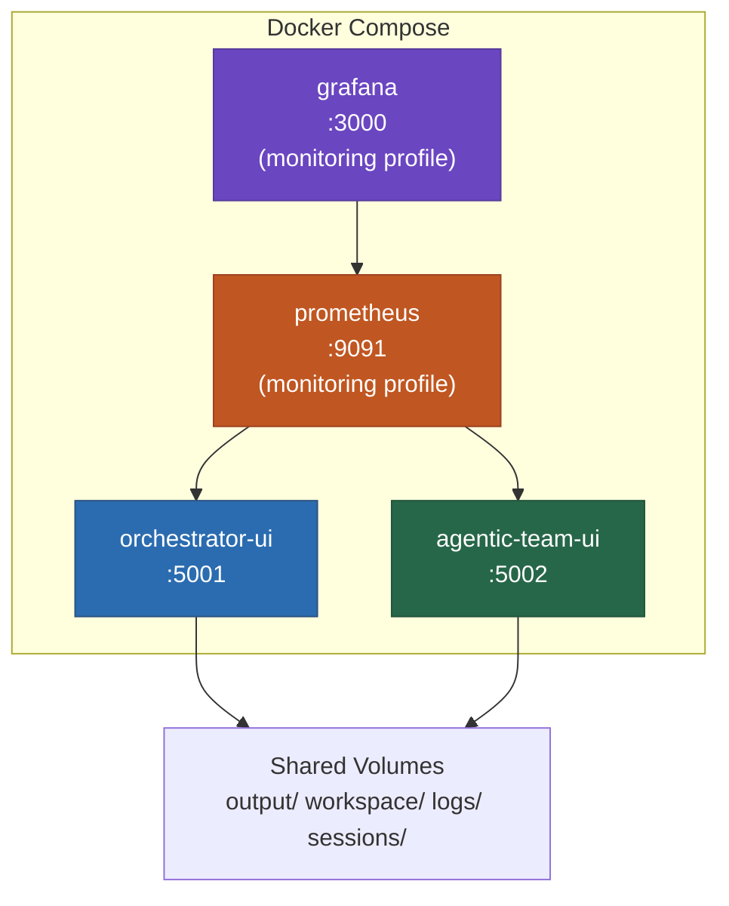
```mermaid
graph TD
    subgraph Docker Compose
        direction TB
        OUI["orchestrator-ui<br/>:5001"]
        AUI["agentic-team-ui<br/>:5002"]
        PROM["prometheus<br/>:9091<br/>(monitoring profile)"]
        GRAF["grafana<br/>:3000<br/>(monitoring profile)"]
    end

    OUI --> SHARED_VOL["Shared Volumes<br/>output/ workspace/ logs/ sessions/"]
    AUI --> SHARED_VOL
    PROM --> OUI
    PROM --> AUI
    GRAF --> PROM

    style OUI fill:#2b6cb0,stroke:#2c5282,color:#fff
    style AUI fill:#276749,stroke:#22543d,color:#fff
    style PROM fill:#c05621,stroke:#9c4221,color:#fff
    style GRAF fill:#6b46c1,stroke:#553c9a,color:#fff
```

```bash
# Start both UIs
docker compose up --build -d

# Start with monitoring (Prometheus + Grafana)
docker compose --profile monitoring up --build -d

# Stop everything
docker compose down
```

### Kubernetes

```bash
kubectl create namespace ai-coding-tools
kubectl apply -f deployment/kubernetes/
kubectl get pods -n ai-coding-tools
```

See [DEPLOYMENT.md](DEPLOYMENT.md) for systemd, Azure, load balancer, and production hardening guides.

## Testing

The unified test suite (386 tests across 60+ modules) covers both systems independently.

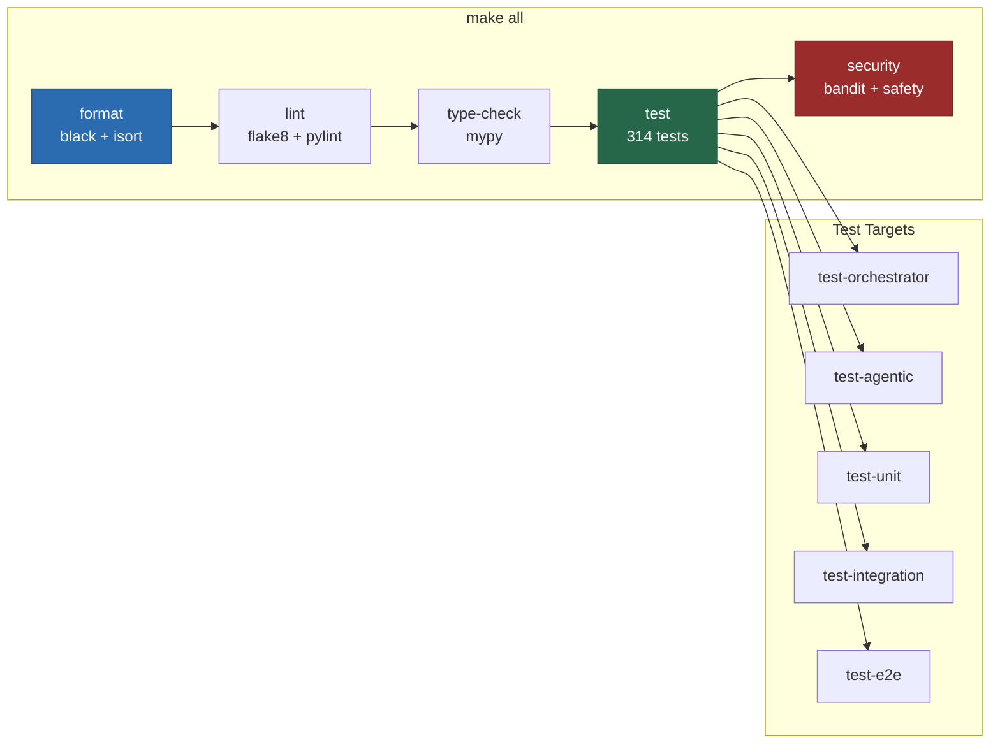
```mermaid
flowchart LR
    subgraph "make all"
        FMT[format<br/>black + isort] --> LINT[lint<br/>flake8 + pylint]
        LINT --> TYPE[type-check<br/>mypy]
        TYPE --> TEST[test<br/>314 tests]
        TEST --> SEC[security<br/>bandit + safety]
    end

    subgraph "Test Targets"
        TEST --> T_ORCH[test-orchestrator]
        TEST --> T_AGENT[test-agentic]
        TEST --> T_UNIT[test-unit]
        TEST --> T_INT[test-integration]
        TEST --> T_E2E[test-e2e]
    end

    style FMT fill:#2b6cb0,stroke:#2c5282,color:#fff
    style TEST fill:#276749,stroke:#22543d,color:#fff
    style SEC fill:#9b2c2c,stroke:#742a2a,color:#fff
```

```bash
# Run all tests
make test

# Orchestrator tests only
make test-orchestrator

# Agentic team tests only
make test-agentic

# Unit tests only
make test-unit

# Integration tests only
make test-integration

# Tests with coverage report
make test-coverage
```

### Code Quality

The codebase maintains a **perfect 10.00/10 pylint score** with zero warnings across the entire project, enforced by 15 pre-commit hooks (black, isort, flake8, mypy, bandit, pyupgrade, and more).

| Metric | Value |
|--------|-------|
| **Pylint Score** | 10.00 / 10 |
| **Warnings** | 0 |
| **Tests Passing** | 386 |
| **Pre-commit Hooks** | 15 / 15 passing |

```bash
make lint              # Lint all Python source (flake8 + pylint)
make format            # Format with black + isort
make type-check        # Run mypy on both subsystems
make security          # Run bandit + safety
make all               # Run everything (format, lint, type-check, test, security)
```

## Monitoring

Prometheus metrics are exposed by the orchestrator UI backend on port 9090.

| Metric | Description |
|---|---|
| `orchestrator_tasks_total` | Total tasks executed |
| `orchestrator_task_duration_seconds` | Task execution time |
| `orchestrator_agent_calls_total` | Agent invocations |
| `orchestrator_agent_errors_total` | Agent error count |
| `orchestrator_cache_hits_total` | Cache performance |

### Reports

The orchestrator automatically generates reports in `reports/` when `create_reports: true` is set in `agents.yaml`. Reports include:

| Report Type | Description |
|---|---|
| **Execution Summary** | Per-task results: steps, agents used, fallbacks, suggestions, duration |
| **Agent Performance** | Aggregated success rates, call counts, task type distribution |
| **Workflow Analytics** | Per-workflow run counts, success rates, average iterations |
| **System Health** | Health check results, disk/memory, Python version, platform |
| **Config Audit** | Agent availability, workflow structure, settings snapshot |
| **HTML Dashboard** | Interactive Chart.js dashboard with KPI cards, bar/line/doughnut charts |

Reports are also generated programmatically via:
```python
from orchestrator.observability import ReportGenerator
gen = ReportGenerator(reports_dir="./reports")
gen.seed_reports(config=config)  # Generate all report types with sample data
```

Health checks:
- Orchestrator: `http://localhost:5001/health`, `http://localhost:5001/ready`
- Agentic Team: `http://localhost:5002/health`, `http://localhost:5002/ready`

## Documentation

| Document                                             | Description                                                      |
|------------------------------------------------------|------------------------------------------------------------------|
| **[SETUP.md](SETUP.md)**                             | Prerequisites, installation, environment setup, troubleshooting  |
| **[ARCHITECTURE.md](ARCHITECTURE.md)**               | System architecture and design patterns                          |
| **[FEATURES.md](FEATURES.md)**                       | Comprehensive feature documentation                              |
| **[AGENTIC_TEAM.md](AGENTIC_TEAM.md)**               | Agentic team runtime details                                     |
| **[OFFLINE_MODE.md](OFFLINE_MODE.md)**               | Offline mode and local model guide                               |
| **[DEPLOYMENT.md](DEPLOYMENT.md)**                   | Docker, Kubernetes, systemd, Azure deployment                    |
| **[ADD_AGENTS.md](ADD_AGENTS.md)**                   | Guide for adding new AI agents                                   |
| **[orchestrator/README.md](orchestrator/README.md)** | Orchestrator subsystem documentation                             |
| **[agentic_team/README.md](agentic_team/README.md)** | Agentic team subsystem documentation                             |
| **[docs/](docs/)**                                   | API references, architecture deep-dives, testing guide, security |

## Screenshots

Some screenshots of the Web UIs and CLI interfaces:

<p align="center">
  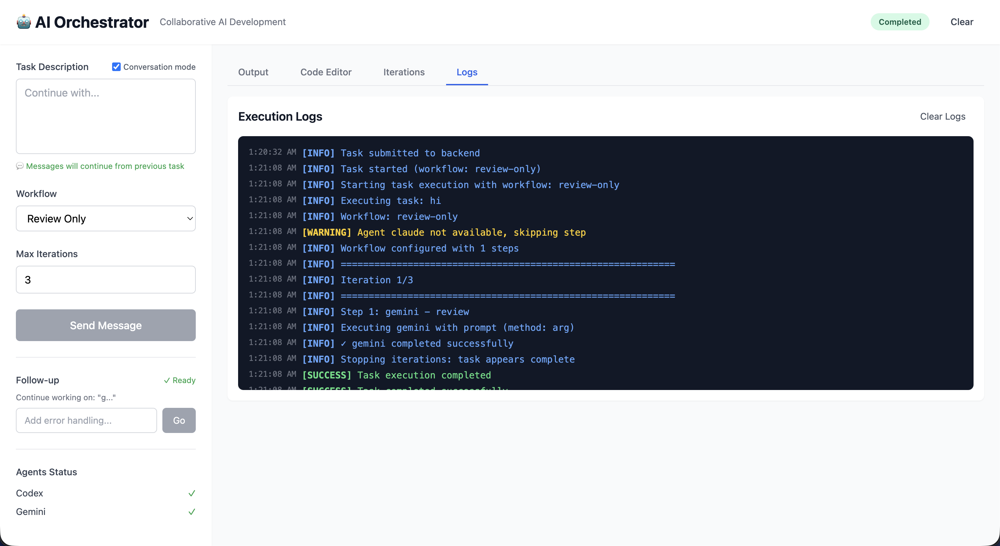
  <br/>
  <em>Orchestrator Web UI — real-time task execution dashboard with agent status and workflow controls</em>
</p>

<p align="center">
  
  <br/>
  <em>Agentic Team Web UI — role-based multi-agent collaboration with live communication view</em>
</p>

<p align="center">
  
  <br/>
  <em>Context Graph Dashboard — interactive knowledge graph visualization with node inspection and hybrid search</em>
</p>

<p align="center">
  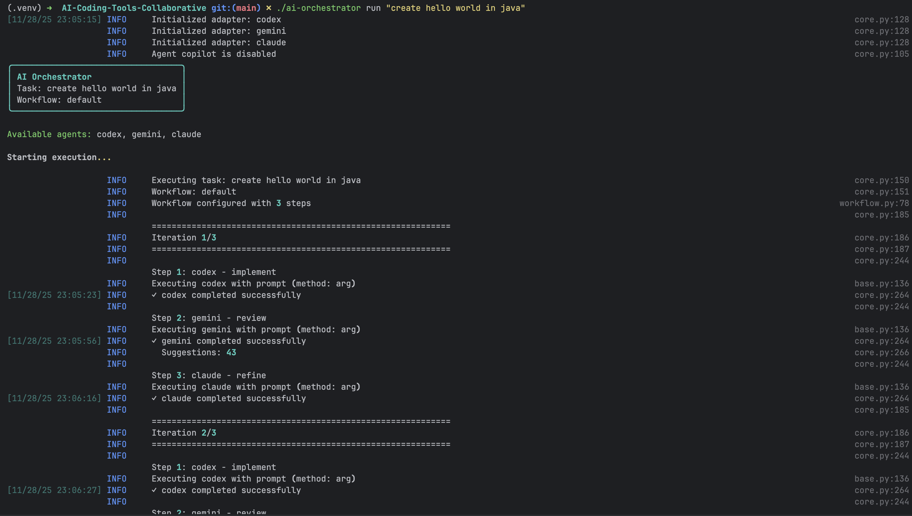
  <br/>
  <em>Orchestrator CLI — command-line interface for task execution and agent management</em>
</p>

<p align="center">
  
  <br/>
  <em>Agentic Shell REPL — interactive shell for direct agent communication and debugging</em>
</p>

<p align="center">
  
  <br/>
  <em>MCP Tools REPL — interactive console for exploring and testing 34+ MCP tools across both engines</em>
</p>

## MCP Server (Optional -- Model Context Protocol)

Both systems are optionally exposed via a [FastMCP](https://github.com/jlowin/fastmcp) server (`mcp_server/`, port 8000), letting any MCP-compatible client (Claude Desktop, other LLM agents, or custom Python scripts) drive task execution programmatically.

```bash
# Start MCP server (stdio -- for Claude Desktop integration)
python -m mcp_server.server

# Start MCP server (HTTP -- for remote clients)
python -m mcp_server.server --transport http --port 8000

# Interactive REPL mode -- explore and test tools from the terminal
python -m mcp_server repl

# Launch the Context Dashboard (port 5003)
python -m context_dashboard
```

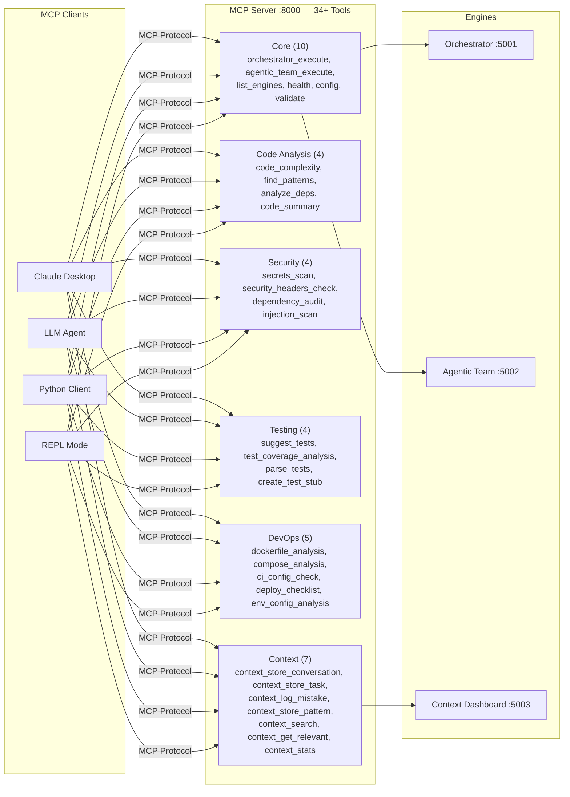
```mermaid
graph LR
    subgraph "MCP Clients"
        CD[Claude Desktop]
        LA[LLM Agent]
        PY[Python Client]
        REPL[REPL Mode]
    end

    subgraph "MCP Server :8000 — 34+ Tools"
        direction TB
        CORE["Core (10)<br/>orchestrator_execute, agentic_team_execute,<br/>list_engines, health, config, validate"]
        CODE["Code Analysis (4)<br/>code_complexity, find_patterns,<br/>analyze_deps, code_summary"]
        SEC["Security (4)<br/>secrets_scan, security_headers_check,<br/>dependency_audit, injection_scan"]
        TEST["Testing (4)<br/>suggest_tests, test_coverage_analysis,<br/>parse_tests, create_test_stub"]
        DEVOPS["DevOps (5)<br/>dockerfile_analysis, compose_analysis,<br/>ci_config_check, deploy_checklist, env_config_analysis"]
        CTX["Context (7)<br/>context_store_conversation, context_store_task,<br/>context_log_mistake, context_store_pattern,<br/>context_search, context_get_relevant, context_stats"]
    end

    subgraph "Engines"
        O[Orchestrator :5001]
        A[Agentic Team :5002]
        D[Context Dashboard :5003]
    end

    CD & LA & PY & REPL -->|MCP Protocol| CORE & CODE & SEC & TEST & DEVOPS & CTX
    CORE --> O & A
    CTX --> D
```

**34+ MCP tools** organized across 6 categories:

| Category | Count | Tools |
|----------|-------|-------|
| **Core Orchestration** | 10 | `orchestrator_execute`, `agentic_team_execute`, `list_engines`, `orchestrator_health`, `agentic_team_health`, `list_workflows`, `list_agents`, `validate_config`, `team_config`, `agentic_team_validate` |
| **Code Analysis** | 4 | `code_complexity`, `find_patterns`, `analyze_deps`, `code_summary` |
| **Security** | 4 | `secrets_scan`, `security_headers_check`, `dependency_audit`, `injection_scan` |
| **Testing** | 4 | `suggest_tests`, `test_coverage_analysis`, `parse_tests`, `create_test_stub` |
| **DevOps** | 5 | `dockerfile_analysis`, `compose_analysis`, `ci_config_check`, `deploy_checklist`, `env_config_analysis` |
| **Context Memory** | 7 | `context_store_conversation`, `context_store_task`, `context_log_mistake`, `context_store_pattern`, `context_search`, `context_get_relevant`, `context_stats` |

See [`mcp_server/tools/`](mcp_server/tools/) for the full tool implementations.

> [!TIP]
> The MCP server is entirely optional. Both the Orchestrator and Agentic Team work fully via their own CLIs and Web UIs without it. Use `python -m mcp_server repl` for an interactive REPL to explore and test tools from the terminal.

## Contributing

Contributions are welcome. Please see [CONTRIBUTING.md](.github/CONTRIBUTING.md) for guidelines.

1. Fork the repository.
2. Create a feature branch: `git checkout -b feature/your-feature`
3. Make your changes and add tests.
4. Run checks: `make all`
5. Commit using [conventional commits](https://www.conventionalcommits.org/): `git commit -m "feat: add amazing feature"`
6. Push and open a Pull Request.

## Security

For security issues, please email hoangson091104@gmail.com. Do not open public issues for security vulnerabilities. See [SECURITY.md](SECURITY.md) for the full security policy.

## License

This project is licensed under the MIT License. See [LICENSE](LICENSE) for details.

## Support

- **Maintainer**: [@hoangsonww](https://github.com/hoangsonww)
- **Issues**: [GitHub Issues](https://github.com/hoangsonww/AI-Agents-Orchestrator/issues)
- **Discussions**: [GitHub Discussions](https://github.com/hoangsonww/AI-Agents-Orchestrator/discussions)

---

<div align="center">

**Made with care and love by [Son Nguyen](https://github.com/hoangsonww) for the AI development community 🤖**

[Back to Top](#ai-coding-tools-orchestrator-and-agentic-team-runtime)

> **Easter egg:** Go to our [wiki page](https://hoangsonww.github.io/AI-Agents-Orchestrator/) and enter Konami code (↑ ↑ ↓ ↓ ← → ← → B A) for a surprise!

</div>
