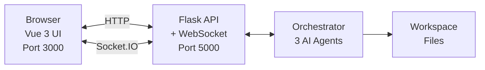

# 🎨 AI Orchestrator Web UI - Quick Start Guide

## What Changed

### ✅ CLI Improvements
1. **Full Output Display** - No more truncation at 500 characters
2. **File Paths Display** - Shows all generated files with 📄 icons
3. **Workspace Location** - Displays workspace directory path

### ✅ New Web UI
- Beautiful Vue 3 interface with real-time updates
- Monaco code editor (same as VS Code)
- File management and downloads
- Progress tracking with iterations view

## Quick Start

### Option 1: Use the CLI (Improved)

```bash
./ai-orchestrator run "create a Python calculator" --workflow default
```

**Now shows:**
- ✅ Full AI response (not truncated)
- ✅ All file paths created
- ✅ Workspace location

### Option 2: Use the Web UI (New!)

**Step 1: Start Backend**
```bash
cd ui
python3 -m venv venv
source venv/bin/activate
pip install -r requirements.txt
python app.py
```

**Step 2: Start Frontend** (in new terminal)
```bash
cd ui/frontend
npm install
npm run dev
```

**Step 3: Open Browser**
```
http://localhost:3000
```

## Web UI Features

### 🎯 Main Interface

**Left Sidebar:**
- Task input with multi-line support
- Workflow selector (5 options)
- Max iterations slider
- Execute button
- Live agent status
- Generated files list (clickable)

**Main Content:**
- **Output Tab**: Full AI response
- **Code Editor Tab**: Monaco editor with:
  - Syntax highlighting
  - Line numbers
  - Minimap
  - Download button
- **Iterations Tab**: Detailed progress tracking

**Header:**
- Status badge (Idle/Running/Completed/Error)
- Clear button

### 🚀 Workflows Available

1. **Default** - Codex → Gemini → Claude (recommended)
2. **Quick** - Codex only (fastest)
3. **Thorough** - Multi-review with Copilot
4. **Review Only** - For existing code
5. **Document** - Generate documentation

### 📝 Example Usage

**1. Simple Task:**
```
Task: Create a Python function that validates email addresses
Workflow: Quick
Max Iterations: 1
```

**2. Production Code:**
```
Task: Build a REST API for user authentication with JWT
Workflow: Default
Max Iterations: 3
```

**3. Code Review:**
```
Task: Review this authentication code for security issues
Workflow: Review Only
Max Iterations: 2
```

## Architecture



## Tech Stack

**Frontend:**
- Vue 3 (Composition API)
- Pinia (State Management)
- Monaco Editor
- Socket.IO Client
- Tailwind CSS
- Vite

**Backend:**
- Flask
- Flask-SocketIO
- Python Orchestrator

**AI Agents:**
- Codex (OpenAI)
- Gemini (Google)
- Claude (Anthropic)

## File Locations

```
AI-Coding-Tools-Collaborative/
├── ai-orchestrator           # CLI (improved)
├── workspace/                # Generated files
├── ui/
│   ├── app.py               # Backend API
│   ├── requirements.txt     # Python deps
│   └── frontend/
│       ├── src/
│       │   ├── App.vue
│       │   ├── components/
│       │   └── stores/
│       ├── package.json     # Node deps
│       └── vite.config.js
└── UI_SETUP.md             # This file
```

## Common Commands

### CLI
```bash
# Quick task
./ai-orchestrator run "task" --workflow quick

# Full workflow
./ai-orchestrator run "task" --workflow default

# View agents
./ai-orchestrator agents

# Validate setup
./ai-orchestrator validate
```

### UI Development
```bash
# Backend
cd ui && python app.py

# Frontend dev server
cd ui/frontend && npm run dev

# Frontend production build
cd ui/frontend && npm run build
```

## Troubleshooting

### CLI: Output still truncated?
- Update your orchestrator: `git pull`
- File is at line 200 in `ai-orchestrator`

### UI: Backend won't start
```bash
cd ui
pip install -r requirements.txt
python app.py
```

### UI: Frontend won't start
```bash
cd ui/frontend
rm -rf node_modules
npm install
npm run dev
```

### UI: Can't connect to backend
- Ensure backend is running on port 5000
- Check browser console for errors
- Disable browser extensions

### Monaco Editor blank
- Clear browser cache
- Check internet connection (CDN)
- Try different browser

## Next Steps

1. ✅ **Try the CLI** with full output
2. ✅ **Launch the Web UI** for better experience
3. ✅ **Test a simple task** with Quick workflow
4. ✅ **Test complex task** with Default workflow
5. ✅ **Download generated files** from Monaco editor

## Benefits of Web UI vs CLI

| Feature | CLI | Web UI |
|---------|-----|--------|
| **Output Display** | Text only | Formatted + Syntax highlighting |
| **File Viewing** | Manual open | Click to view in Monaco |
| **Progress Tracking** | Text logs | Visual progress indicators |
| **File Downloads** | Manual copy | One-click download |
| **Iterations** | Terminal output | Organized tabs |
| **Multi-tasking** | Blocking | Non-blocking |
| **Code Editing** | External editor | Built-in Monaco |

## Pro Tips

1. **Use Quick workflow** for testing and iteration
2. **Use Default workflow** for production code
3. **Download files immediately** before clearing
4. **Watch iterations tab** to understand AI decisions
5. **CLI is faster** for simple one-off tasks
6. **UI is better** for complex multi-file projects

Enjoy your enhanced AI development workflow! 🚀
