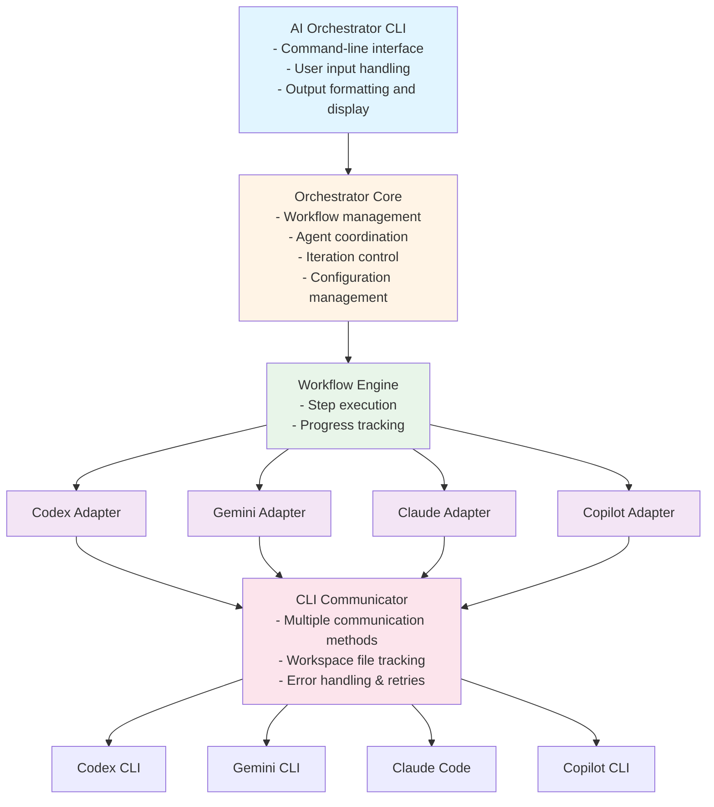
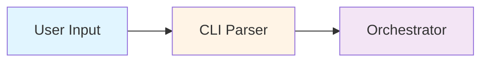
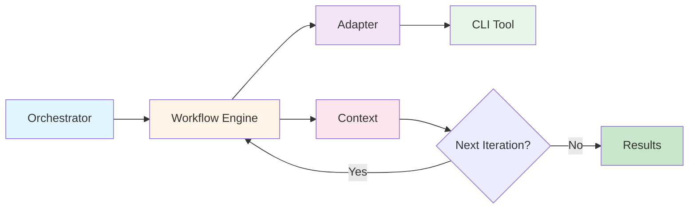
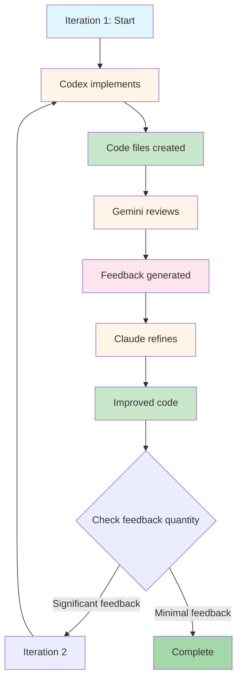

# Architecture Documentation

## Overview

The AI Coding Tools Collaborative system orchestrates multiple AI coding assistants to work together on software development tasks. The architecture follows a modular, extensible design that allows easy addition of new AI agents and workflows.

## System Architecture



## Core Components

### 1. Orchestrator Core (`orchestrator/core.py`)

**Responsibilities:**
- Load and manage configuration
- Initialize and coordinate adapters
- Execute workflows with iteration control
- Manage execution context between steps
- Determine when to stop iterating

**Key Methods:**
- `execute_task()`: Main entry point for task execution
- `_build_workflow_steps()`: Converts config to executable steps
- `_execute_workflow_iteration()`: Runs one iteration of the workflow
- `_should_stop_iteration()`: Decides if refinement is complete

### 2. Workflow Engine (`orchestrator/workflow.py`)

**Responsibilities:**
- Manage workflow step execution
- Track progress through workflows
- Build task descriptions for each step type
- Handle step-to-step context passing

**Key Classes:**
- `WorkflowEngine`: Executes complete workflows
- `WorkflowStep`: Represents individual workflow steps

### 3. Task Manager (`orchestrator/task_manager.py`)

**Responsibilities:**
- Create and track tasks
- Monitor task status (pending, in_progress, completed, failed)
- Provide execution statistics
- Manage task lifecycle

### 4. Base Adapter (`adapters/base.py`)

**Responsibilities:**
- Define adapter interface
- Provide common functionality
- Handle CLI availability checks
- Manage timeout and error handling

**Key Methods:**
- `execute_task()`: Abstract method for task execution
- `get_capabilities()`: Return agent capabilities
- `is_available()`: Check if CLI tool is installed
- `_run_command_with_prompt()`: Execute CLI with proper communication

### 5. CLI Communicator (`adapters/cli_communicator.py`)

**Responsibilities:**
- Handle multiple CLI communication patterns (stdin, args, files, heredoc)
- Track file modifications in workspace
- Implement retry logic
- Manage timeouts

**Communication Methods:**
- **stdin**: Pass prompt via standard input
- **file**: Use file-based input/output
- **arg**: Pass prompt as command argument
- **heredoc**: Use bash heredoc for complex prompts

### 6. Specific Adapters

#### Claude Adapter (`adapters/claude_adapter.py`)
- **Role**: Refinement and improvement
- **Capabilities**: Implementation, Refactoring, Code Review, Debugging
- **Communication**: Workspace-based with file tracking

#### Codex Adapter (`adapters/codex_adapter.py`)
- **Role**: Initial implementation
- **Capabilities**: Implementation, Testing, Debugging
- **Communication**: Workspace-based with file tracking

#### Gemini Adapter (`adapters/gemini_adapter.py`)
- **Role**: Code review and architecture analysis
- **Capabilities**: Code Review, Architecture, Testing, Documentation
- **Communication**: Standard execution (review-only, no file modification)

#### Copilot Adapter (`adapters/copilot_adapter.py`)
- **Role**: Alternative suggestions
- **Capabilities**: Implementation, Debugging, Testing
- **Communication**: Standard execution for suggestions

## Data Flow

### 1. Task Submission



### 2. Workflow Execution



### 3. Iteration Loop



## Configuration System

### Configuration Structure

```yaml
agents:
  <agent_name>:
    enabled: bool
    command: string
    role: string
    timeout: int

workflows:
  <workflow_name>:
    - agent: string
      task: string

settings:
  max_iterations: int
  output_dir: string
  log_level: string
```

### Configuration Loading

1. Check for user-provided config path
2. Fall back to `config/agents.yaml`
3. Use built-in defaults if no config found

## Error Handling

### Levels of Error Handling

1. **CLI Communication Level**
   - Timeout handling
   - Retry logic (exponential backoff)
   - Command execution errors

2. **Adapter Level**
   - Task execution errors
   - Output parsing errors
   - Invalid response handling

3. **Orchestrator Level**
   - Workflow execution errors
   - Missing agent handling
   - Configuration errors

4. **CLI Level**
   - User input validation
   - Display of error messages
   - Graceful degradation

## Extensibility

### Adding a New Agent

1. Create adapter class inheriting from `BaseAdapter`
2. Implement required methods:
   - `get_capabilities()`
   - `execute_task()`
3. Register in `AgentCLIRegistry` with communication pattern
4. Add to `orchestrator/core.py` adapter initialization
5. Configure in `config/agents.yaml`

### Adding a New Workflow

1. Define workflow in `config/agents.yaml` under `workflows:`
2. Specify sequence of agents and tasks
3. Workflow automatically available via CLI

### Adding a New Communication Method

1. Add method to `CLICommunicator.execute_with_prompt()`
2. Implement method-specific execution logic
3. Register pattern in `AgentCLIRegistry`

## Performance Considerations

### Optimization Strategies

1. **Parallel Execution** (Future Enhancement)
   - Execute independent reviews in parallel
   - Aggregate feedback before refinement

2. **Caching**
   - Cache agent availability checks
   - Store intermediate results

3. **Smart Iteration Control**
   - Stop when feedback is minimal
   - Track quality metrics to avoid unnecessary iterations

4. **Workspace Management**
   - Efficient file modification tracking
   - Incremental updates only

## Security Considerations

1. **Input Validation**
   - Sanitize user prompts
   - Validate configuration files

2. **Subprocess Safety**
   - Use timeouts to prevent hanging
   - Capture and sanitize command output

3. **File System Safety**
   - Restrict workspace to designated directories
   - Validate file paths

4. **Authentication**
   - Rely on individual CLI tool authentication
   - No credential storage in orchestrator

## Testing Strategy

### Unit Tests
- Test individual adapters
- Test orchestrator logic
- Test workflow engine
- Test task manager

### Integration Tests
- Test complete workflows
- Test CLI communication
- Test error handling
- Test file tracking

### End-to-End Tests
- Test full task execution
- Test all communication methods
- Test timeout and retry logic

## Future Enhancements

1. **Agent Capabilities Matching**
   - Automatically select best agent for task type
   - Dynamic workflow generation

2. **Quality Metrics**
   - Code quality scoring
   - Automated acceptance criteria

3. **Parallel Agent Execution**
   - Run reviews in parallel
   - Faster iteration cycles

4. **Interactive Mode**
   - Human-in-the-loop decisions
   - Manual feedback injection

5. **Result Caching**
   - Cache successful implementations
   - Reuse similar solutions

6. **Web Interface**
   - Browser-based UI
   - Visual workflow builder
